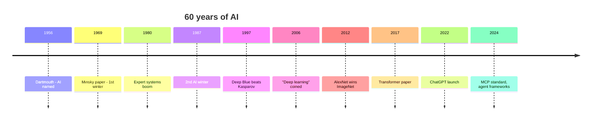
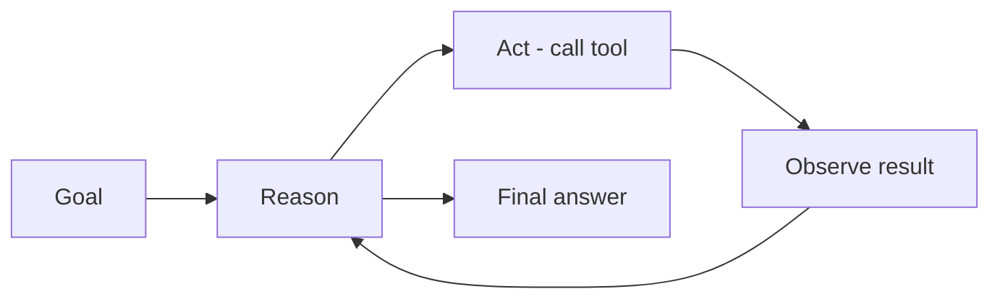
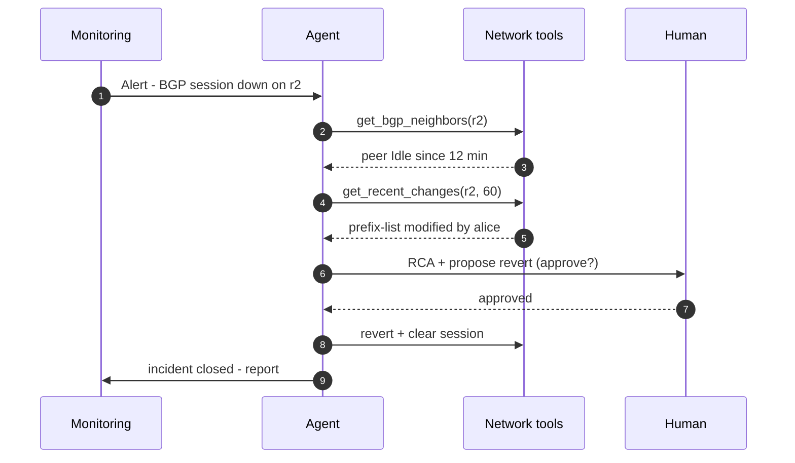
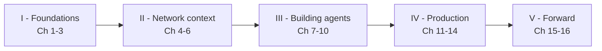

# 00 — Introduction: From AI to Agentic Ops

> **Format:** 1-hour lecture (60 min).
> **Audience:** BSc students, networking background, little or no prior AI.
> **Goal:** by the end you can place ML, DL, LLMs and AI agents on a single mental map, and explain why "Agentic Ops" is the natural next step for network operations.

| Section | Topic | Duration |
|:--|:--|:--|
| 1 | Why this course matters | 5 min |
| 2 | The origins of AI (1950–2010) | 10 min |
| 3 | The Machine Learning era | 10 min |
| 4 | The Deep Learning revolution | 10 min |
| 5 | LLMs and the rise of AI agents | 10 min |
| 6 | AI in networking: from ML to Agentic Ops | 10 min |
| 7 | Roadmap of the rest of the course | 5 min |

---

## 1. Why this course matters (5 min)

Network operations are entering their **third automation wave**:

1. **Scripting (1990s–2000s).** Engineers wrote Perl/Expect/Bash scripts to push CLI commands.
2. **Programmable infrastructure (2010s).** Ansible, NETCONF/YANG, REST APIs, GitOps. Humans still decide; tools execute.
3. **Agentic Ops (2024–).** An AI **decides what to do**, calls tools, observes results, asks for help when needed, and **closes the loop**.

The first two waves removed *typing*. This one removes *deciding*.

> "Software is eating the world."  —  Marc Andreessen, 2011
> "AI is eating software."           —  Jensen Huang, 2017
> "Agents are eating AI."            —  the field, 2024+

**Why now?**
- LLMs became good enough at **structured output** and **tool use**.
- Standards like **MCP (Model Context Protocol)** make tool integration uniform.
- Network telemetry is already streamable (gNMI, NetFlow, OpenTelemetry), so feeding agents is cheap.

This course teaches you how to build, evaluate and operate such agents — safely.

---

## 2. The origins of AI (1950–2010) — 10 min

### 2.1 The founding ideas

| Year | Event | Why it matters |
|:--|:--|:--|
| **1943** | McCulloch & Pitts — first formal neuron | First mathematical model of a brain cell. |
| **1950** | Alan Turing — *Computing Machinery and Intelligence* | Defines the *imitation game* ("Turing test"). |
| **1956** | Dartmouth Workshop | Coins the term *Artificial Intelligence*; sets the agenda for the next 60 years. |
| **1957** | Rosenblatt — Perceptron | First trainable neural network. |
| **1969** | Minsky & Papert — *Perceptrons* | Shows perceptron limits → first AI winter. |

### 2.2 Two rival schools

Two paradigms competed for decades — and still coexist:

| | **Symbolic AI** (1956–~1990) | **Connectionist AI** (1980s–today) |
|:--|:--|:--|
| Knowledge | Hand-written rules, logic | Learned from data |
| Strength | Explainable, exact | Robust to noise, scales |
| Examples | Expert systems (MYCIN, CLIPS) | Neural networks, deep learning |
| Failure mode | Brittle; can't handle novelty | Black box; needs lots of data |

### 2.3 AI winters

Two periods of disillusionment when funding collapsed:
- **1974–1980** — symbolic AI hit a wall on real-world ambiguity.
- **1987–1993** — expert systems were too expensive to maintain.

Lesson: the field repeatedly **over-promises**. Healthy scepticism is part of the job.



---

## 3. The Machine Learning era (10 min)

In the 2000s, the field pivoted from *programming intelligence* to *learning it from data*. That's **Machine Learning**.

### 3.1 A working definition

> A program **learns** from experience E with respect to a task T and performance measure P, if its performance on T, as measured by P, improves with E.
> — Tom Mitchell, 1997

In practice: instead of writing `if … then …` rules, you collect examples and let an algorithm **fit a function**.

### 3.2 The three flavours

| Paradigm | What it learns | Network examples |
|:--|:--|:--|
| **Supervised** | Map inputs → labels | Spam vs ham email, malicious flow classification, predicted link utilisation |
| **Unsupervised** | Hidden structure | Traffic clustering, anomaly detection on NetFlow |
| **Reinforcement** | A policy maximising reward | Traffic engineering, congestion control (e.g. PCC-Vivace) |

### 3.3 Classic algorithms you should recognise

- **Linear / logistic regression** — the workhorses, still unbeatable on tabular data.
- **Decision trees / Random Forests / Gradient Boosting (XGBoost)** — won most Kaggle competitions 2010–2020.
- **k-means, DBSCAN** — clustering.
- **SVM** — once the dominant classifier; now mostly historical.
- **HMMs, Bayesian networks** — sequence and probabilistic reasoning.

### 3.4 What ML cannot do well

- Raw images, audio, text — requires **manual feature engineering**.
- Tasks where the *representation* matters more than the *classifier*.

That limitation is exactly what Deep Learning solved.

---

## 4. The Deep Learning revolution (10 min)

### 4.1 The trigger: ImageNet 2012

In 2012, **AlexNet** (Krizhevsky, Sutskever, Hinton) won the ImageNet competition with a deep convolutional network running on two GPUs. Error rate dropped from 26% to 15%. The field changed overnight.

Three ingredients converged:
1. **Data** — ImageNet (14M labelled images).
2. **Compute** — consumer GPUs (CUDA, 2007).
3. **Algorithms** — ReLU, dropout, better initialisation, backpropagation at scale.

### 4.2 The architectures that mattered

| Year | Architecture | Breakthrough |
|:--|:--|:--|
| 2012 | **CNN (AlexNet)** | Vision |
| 2014 | **GAN** | Generative images |
| 2015 | **ResNet** | Trains 100+ layers via skip connections |
| 2017 | **Transformer** | Self-attention; the backbone of every modern LLM |
| 2018 | **BERT, GPT-1** | Pre-train + fine-tune paradigm |
| 2020 | **GPT-3** | 175 B parameters — "few-shot" prompting works |
| 2022 | **ChatGPT** | Conversational LLM goes mainstream |
| 2023+ | **GPT-4, Claude, Llama, Mistral, Gemini** | Multimodal, reasoning, open-weight models |

### 4.3 Why Deep Learning is different

| | Classical ML | Deep Learning |
|:--|:--|:--|
| Feature engineering | Manual, painful | Learned automatically |
| Data appetite | KB–MB | GB–TB |
| Compute appetite | CPU | GPU/TPU |
| Strength | Tabular, small data | Perception, language |
| Interpretability | High | Low (active research area) |

### 4.4 The Transformer in one sentence

> A Transformer is a stack of layers where each token can **attend** (look at) every other token, weighted by a learned similarity score — letting the model build context-aware representations of *anything you can tokenise* (text, code, images, packets…).

Without the Transformer there would be no LLMs, no agents, and no Agentic Ops.

---

## 5. LLMs and the rise of AI agents (10 min)

### 5.1 What is a Large Language Model?

A neural network — typically a Transformer with billions of parameters — trained on trillions of tokens to **predict the next token**. That deceptively simple objective produces a system that can summarise, translate, reason step by step, write code and call tools.

```
"The capital of France is ___"   →  the model outputs probabilities for the next token
                                    Paris (0.87), Lyon (0.02), Berlin (0.01), …
```

Two crucial steps turn a raw LLM into something useful:
- **Instruction tuning** — fine-tune on (prompt, answer) pairs so it follows instructions.
- **RLHF / DPO** — human-preference learning so it is helpful and harmless.

### 5.2 From answering to acting

An LLM **on its own** only produces text. To make it *act*, we add three things:

| Building block | Purpose |
|:--|:--|
| **Tools** (function calling) | Let the model invoke real APIs: `get_bgp_neighbors(device="r2")` |
| **Memory / context** | Conversation history, retrieved documents (RAG) |
| **A control loop** | Reason → Act → Observe → repeat (the **ReAct** pattern) |

Add those three and you have an **AI agent**:



### 5.3 The agent zoo today

| Pattern | One-liner |
|:--|:--|
| **Single-agent ReAct** | One LLM, a tool belt, a loop. The default starting point. |
| **Plan-and-execute** | Plan all steps first, execute, replan on error. |
| **Multi-agent (supervisor + workers)** | One coordinator delegates to specialists. |
| **Human-in-the-loop** | Agent proposes; human approves risky actions. |
| **Closed-loop autonomous** | Agent monitors + acts continuously, with guardrails. |

### 5.4 Why 2024–2026 changed everything

- **Tool-use reliability** crossed a usability threshold (>90% correct call rate on common APIs).
- **MCP (Model Context Protocol)** — Anthropic's open spec — became the *USB-C of agents*: any model can talk to any tool server.
- **Open-weight models** (Llama 3, Mistral, Qwen) made on-premise deployment realistic — critical for telcos and regulated industries.

---

## 6. AI in networking: from ML to Agentic Ops (10 min)

Networking has actually been using AI for two decades — just quietly.

### 6.1 Three eras of AI in networking

| Era | Approach | Typical use cases | Limits |
|:--|:--|:--|:--|
| **AIOps 1.0** (~2010–2018) | Statistical ML on telemetry | Anomaly detection, alert correlation, baseline forecasting | Per-vendor silos, brittle, "yet another dashboard" |
| **AIOps 2.0 / DL** (~2018–2023) | Deep models on flows/logs | Encrypted traffic classification, malware detection, predictive failure | Needs huge labelled datasets per environment |
| **Agentic Ops** (2024–) | LLM agents + tools + RAG | Conversational troubleshooting, automated RCA, closed-loop remediation | Cost, hallucinations, governance — what this course addresses |

### 6.2 What changes with agents

A traditional NMS surfaces an alert. An agent **acts on it**:



You will build exactly this kind of agent in **Notebook 01** (BGP ReAct agent) and **Chapter 7**.

### 6.3 Where agents are already in production

| Use case | What the agent does |
|:--|:--|
| **Tier-1 triage assistant** | Summarises tickets, retrieves runbooks (RAG), proposes next action. |
| **Configuration validator** | Reads diff, predicts impact, flags violations of policy. |
| **Capacity planning copilot** | Joins telemetry, change log, demand forecast; recommends upgrades. |
| **Security incident responder** | Correlates NetFlow + EDR + threat-intel, isolates host via NAC. |
| **Customer-facing chatbot** | Answers connectivity questions grounded in your topology data. |

### 6.4 What makes networking *hard* for agents

- **High blast radius** — one bad config can take down a region.
- **Non-stationary** — topologies, traffic patterns and policies change daily.
- **Multi-vendor data models** — IOS-XE ≠ JunOS ≠ SR Linux.
- **Compliance** — telco, finance and government need full audit trails.

These constraints drive Chapters 11 (observability), 12 (safety), and 14 (AgentOps lifecycle).

---

## 7. Roadmap of the rest of the course (5 min)

The 16 chapters are organised into five parts, each building on the previous one:



| Part | What you will learn |
|:--|:--|
| **I — Foundations** | LLMs, agent anatomy, prompts, ReAct. |
| **II — Network Context** | Telemetry data, tools an agent needs, RAG over runbooks. |
| **III — Workflows** | Building troubleshooting agents, multi-agent, human-in-the-loop, closed-loop. |
| **IV — Production** | Observability, evaluation, safety, cost, AgentOps lifecycle. |
| **V — Forward** | Ethics, limitations, capstone projects. |

Two runnable notebooks accompany the handouts:
- **`notebooks/01-bgp-troubleshooting-react-agent.ipynb`** — a tiny ReAct agent on a mocked 4-router fabric.
- **`notebooks/02-netflow-anomaly-rag.ipynb`** — a RAG pipeline over runbooks for NetFlow anomalies.

A Slidev deck (`slidev/`) mirrors the lectures.

---

## Recap — the one-slide mental model

```
       1956                    1997                     2017                       2024
        |                        |                        |                          |
   Symbolic AI ───► Statistical ML ───► Deep Learning ───► LLMs ───► AGENTS ───► Agentic Ops
                       (Random Forest)      (CNN, RNN)     (GPT,      (ReAct,       (closed-loop
                                                            Llama)     MCP, multi)   network ops)
```

Every era *added a layer on top* of the previous one. None of them disappeared — your future network platform will run **all four** side by side: rules for compliance, classical ML for forecasting, deep models for traffic understanding, and LLM agents for orchestration.

---

## Quick self-check (homework)

1. Give one example each of supervised, unsupervised and reinforcement learning **in networking**.
2. Why did Deep Learning beat classical ML on image and language tasks, but not on small tabular datasets?
3. List the three building blocks that turn an LLM into an *agent*.
4. Name two reasons why "Agentic Ops" is harder than a chatbot.
5. Sketch the ReAct loop from memory.

Answers — and the rest of the journey — start in **Chapter 1**.
