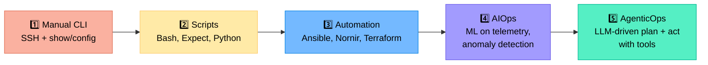
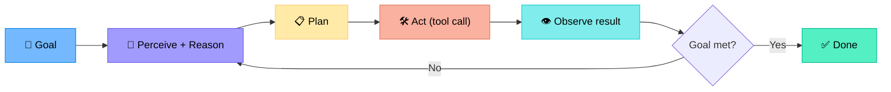
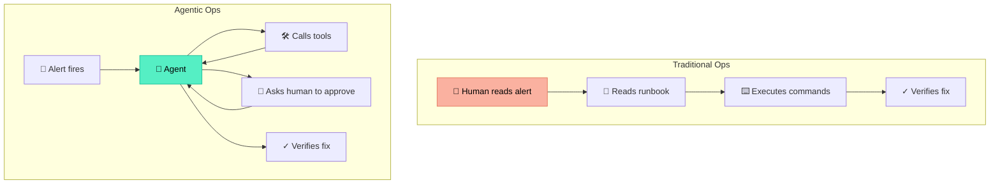
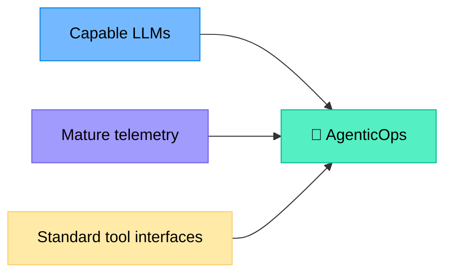
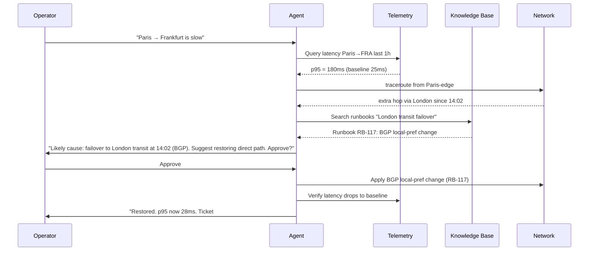
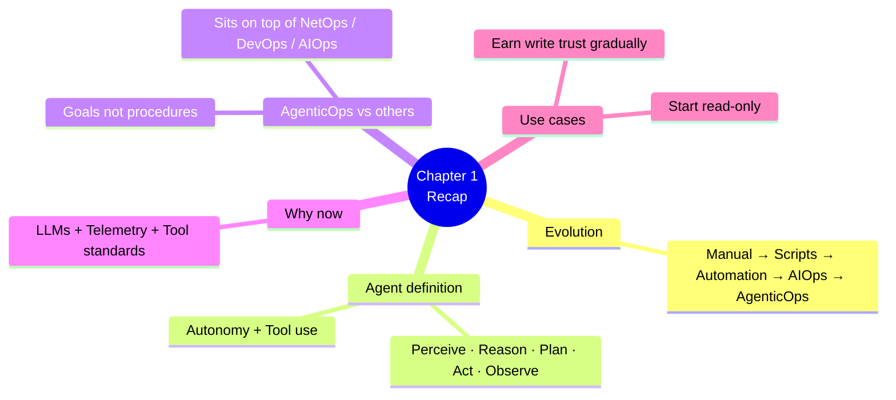

# Chapter 1 — From Automation to Agentic Operations

> **Learning objectives:** Trace the evolution from manual CLI to agentic ops, define what an "agent" is, distinguish Agentic Ops from NetOps/DevOps/AIOps, and identify realistic use cases on a network.

---

## 1.1 The evolution: manual CLI → AgenticOps

Network operations have evolved through five major eras. Each era added a layer of abstraction and reduced the number of repetitive human actions.

| Era | What humans do | What machines do |
|:--|:--|:--|
| **Manual CLI** | Type every command, interpret every output | Execute one command at a time |
| **Scripts** | Write logic once, run many times | Replay deterministic sequences |
| **Automation** | Declare desired state | Reconcile state idempotently |
| **AIOps** | Define models, interpret alerts | Detect anomalies, correlate events |
| **AgenticOps** | Define goals and guardrails | **Plan, decide, act, verify** autonomously |

> **The key shift:** Earlier eras automate *the how*. AgenticOps lets you specify *the what* (a goal) and lets the agent figure out *the how* using available tools.

---

## 1.2 What is an "agent"?

An **AI agent** is a software system that can:

1. **Perceive** its environment (read telemetry, query APIs, search docs)
2. **Reason** about a goal (powered by an LLM)
3. **Plan** a sequence of actions
4. **Act** by calling tools (functions, APIs, CLI wrappers)
5. **Observe** the result and decide what to do next
6. **Stop** when the goal is met (or escalate to a human)

### Key properties

| Property | Meaning |
|:--|:--|
| **Autonomy** | Operates without step-by-step human input |
| **Reactivity** | Responds to changes in the environment |
| **Pro-activity** | Pursues goals, not just reflexes |
| **Goal-directedness** | All actions serve a stated objective |
| **Tool use** | Calls external functions/APIs to gather data and act |
| **Memory** | Remembers context within a task (and sometimes across tasks) |

> **Test:** A Python script that reboots a router on a cron job is **not** an agent. A program that receives "site B is degraded — investigate and fix if safe" and figures out the rest **is** an agent.

---

## 1.3 AgenticOps vs. NetOps, DevOps, and AIOps

| Discipline | Primary actor | Primary artifact | Decision logic |
|:--|:--|:--|:--|
| **NetOps** | Network engineer | Configs, change tickets | Human, runbook-based |
| **DevOps** | Developer/SRE | Pipelines, IaC | Deterministic code |
| **AIOps** | ML model + operator | Alerts, dashboards, correlations | Statistical / pattern-based |
| **AgenticOps** | LLM agent + operator | Goals, traces, audit logs | LLM reasoning + tools |

> **AgenticOps does not replace AIOps or automation** — it sits on top, orchestrating them. A good agent will call your existing Ansible playbooks, your AIOps detectors, and your monitoring APIs.

---

## 1.4 Why now? The three converging trends

1. **Capable LLMs** — Models like GPT-4, Claude, Llama 3+ can reason over long contexts, call tools reliably, and follow complex instructions.
2. **Mature telemetry** — Streaming telemetry (gNMI), OpenConfig, NetFlow at scale, and observability stacks (Prometheus, OTel) give agents the raw data they need.
3. **Standardised tool interfaces** — Function calling, MCP (Model Context Protocol), and frameworks like LangGraph make it easy to expose network operations as agent tools.

---

## 1.5 Use cases on a network

| Use case | Typical agent action | Risk level |
|:--|:--|:--|
| **Reactive troubleshooting** | "Why is site A slow?" → query telemetry, correlate, propose root cause | Low (read-only) |
| **Incident triage** | Classify alerts, enrich with topology context, route to right team | Low |
| **Config drift detection** | Compare running vs. intended config, summarise deltas | Low |
| **Capacity planning** | Analyse trends, predict saturation, suggest upgrades | Low |
| **Change risk assessment** | Pre-validate a planned change against impact graph | Low |
| **Auto-remediation (suggested)** | Propose a fix, wait for human approval | Medium |
| **Auto-remediation (executed)** | Apply fix in a sandboxed/limited scope | **High** |
| **Closed-loop SLA enforcement** | Continuously rebalance traffic to meet SLAs | **High** |

> **Maturity rule:** Start read-only. Earn trust. Add write actions one at a time, each behind an approval gate and a kill switch.

---

## 1.6 A worked mini-example

Imagine a Slack message:

> **Operator:** "Users in Paris report slow connectivity to the Frankfurt data centre."

A non-agentic system would file a ticket. An **agentic** system might:

This is the loop you'll learn to build over the rest of the course.

---

## Summary

---

## Exercises

1. **Classify the era.** For each of the following, which era of network operations does it belong to?
   - A. A bash script that backs up router configs every night.
   - B. An LLM that reads syslog, identifies a flapping interface, and opens a ticket.
   - C. An ML model that detects DDoS patterns in NetFlow.
   - D. An engineer SSHing into a switch to change a VLAN.
2. **Agent or not?** A scheduled job restarts a BGP session if it detects flapping. Is it an agent? Justify.
3. **Pick a use case.** Choose one of the 8 use cases in §1.5 and describe what tools and data sources an agent would need to perform it.
4. **Risk ranking.** Order the 8 use cases from lowest to highest blast radius. Where would you draw the line for "needs human approval"?
5. **Design.** Sketch a sequence diagram (like §1.6) for the goal: *"Audit all access switches for non-compliant SNMP communities and report violations."*
