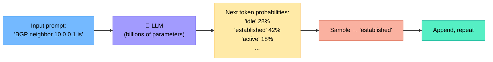
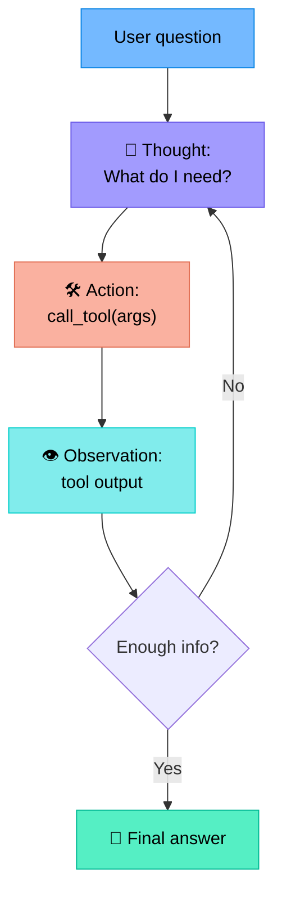
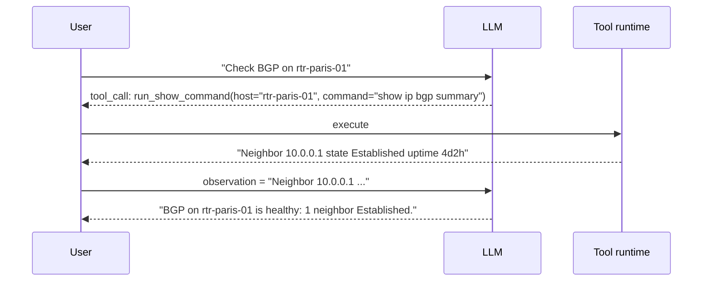
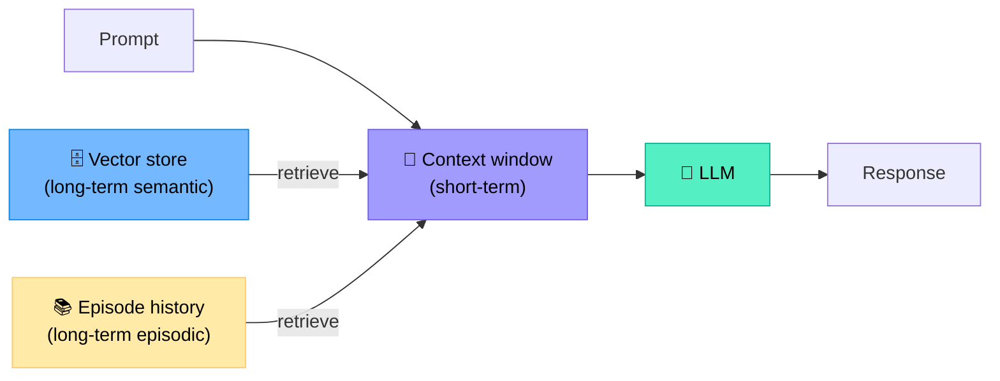
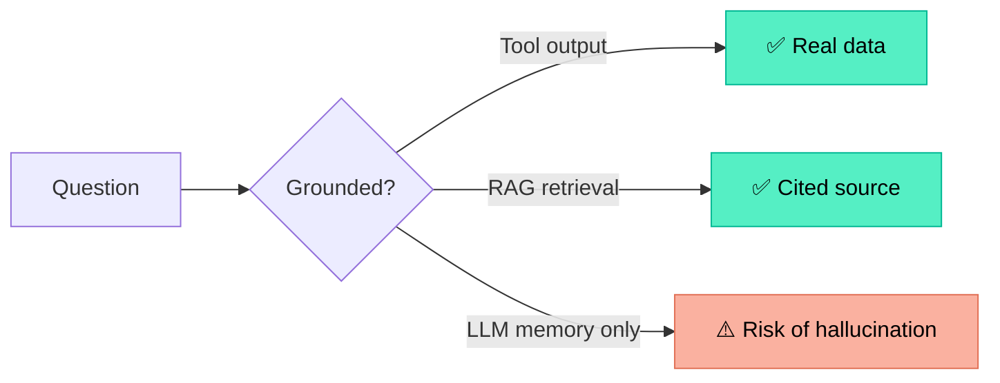
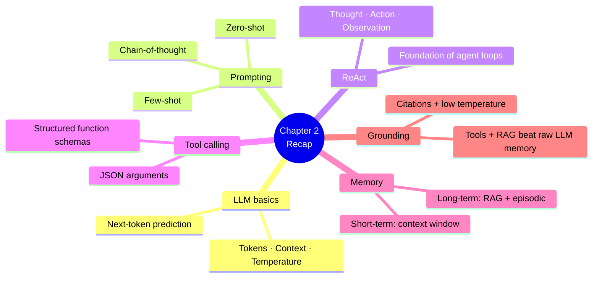

# Chapter 2 — LLM and Agent Fundamentals (Crash Course)

> **Learning objectives:** Understand how an LLM works at a high level, master core prompting techniques, grasp the ReAct pattern, see how tool calling works, and recognise hallucinations and grounding strategies.

---

## 2.1 What is a Large Language Model?

A **Large Language Model (LLM)** is a neural network trained to predict the next **token** (a piece of text) given a sequence of previous tokens.



### Key concepts

| Term | Meaning |
|:--|:--|
| **Token** | A sub-word unit (e.g. `"BGP"`, `" neigh"`, `"bor"`). ~4 chars ≈ 1 token in English. |
| **Context window** | The maximum number of tokens the model can see at once (e.g., 8k, 128k, 1M). |
| **Parameters** | Learned weights — billions for modern models (Llama 3 = 8B / 70B / 405B). |
| **Inference** | The act of generating text from a prompt (vs. *training*). |
| **Temperature** | Randomness of sampling: 0 = deterministic, 1+ = creative. |

> **For network ops:** Use low temperature (0–0.3) for diagnostic and config tasks — you want consistent, reproducible answers, not creativity.

---

## 2.2 Prompting basics

A **prompt** is the input you give to the LLM. The quality of the prompt largely determines the quality of the output.

### Three foundational techniques

| Technique | Example | When to use |
|:--|:--|:--|
| **Zero-shot** | "Summarise this BGP log in one sentence: ..." | Simple, well-known tasks |
| **Few-shot** | Give 2–3 example input/output pairs, then the new input | Tasks with specific format requirements |
| **Chain-of-thought (CoT)** | "Think step by step before answering." | Multi-step reasoning |

### Zero-shot example

```text
Prompt:
Classify the following syslog message as INFO, WARN, or CRITICAL.
Message: "%BGP-3-NOTIFICATION: sent to neighbor 10.0.0.1 6/2 (cease) 0 bytes"

Answer:
```

### Few-shot example

```text
Classify syslog severity (INFO/WARN/CRITICAL):

"Interface GigE0/0/1 is up"          → INFO
"CPU usage 87%"                       → WARN
"BGP neighbor 10.0.0.1 went DOWN"     → CRITICAL

"OSPF adjacency 192.168.1.1 lost"     →
```

### Chain-of-thought example

```text
Question: An interface counter shows 1,200 CRC errors in 5 minutes on a 10G link.
Is this a problem? Think step by step.

Step 1: Compute the error rate per second.
Step 2: Compare to a healthy baseline (typically < 0.1 errors/sec).
Step 3: Consider possible causes (bad SFP, fibre, duplex).
Step 4: Recommend a next action.
```

CoT improves accuracy on reasoning tasks but uses more tokens.

---

## 2.3 The ReAct pattern — Reasoning + Acting

ReAct is the simplest and most widely used agent loop. The LLM alternates between:

- **Thought** — internal reasoning ("I need to check the interface counters")
- **Action** — calling a tool ("`show interface gi0/0/1`")
- **Observation** — reading the tool's result



### Worked trace

```text
Question: Is interface Gi0/0/1 on rtr-paris-01 healthy?

Thought: I need to look at the interface state and error counters.
Action: run_show_command(host="rtr-paris-01", cmd="show interface Gi0/0/1")
Observation: "Gi0/0/1 is up, line protocol is up
              5 minute input rate 120 Mbps, output rate 95 Mbps
              0 input errors, 0 CRC, 0 frame
              0 output errors, 0 collisions, 0 interface resets"

Thought: Counters are clean. The interface looks healthy.
Final answer: Gi0/0/1 on rtr-paris-01 is healthy — link up, no errors in the last 5 minutes.
```

> ReAct was introduced by Yao et al. (2022) and is now the foundation of most agent frameworks (LangGraph, AutoGen, etc.).

---

## 2.4 Tool calling (a.k.a. function calling)

Modern LLM APIs let you describe **functions** in a structured way. The model decides when to call them and outputs a JSON object with the arguments.

### Example: tool schema

```python
tools = [
    {
        "name": "run_show_command",
        "description": "Run a read-only show command on a network device.",
        "parameters": {
            "type": "object",
            "properties": {
                "host":    {"type": "string", "description": "Device hostname"},
                "command": {"type": "string", "description": "CLI command, e.g. 'show ip bgp summary'"}
            },
            "required": ["host", "command"]
        }
    }
]
```

### Round-trip



### Why tools?

| Without tools | With tools |
|:--|:--|
| LLM hallucinates outputs | LLM gets real, live data |
| Limited to training data | Reaches today's network state |
| Can only talk | Can also act (apply configs, restart services) |

---

## 2.5 Memory: short-term and long-term

| Memory type | Storage | Example use |
|:--|:--|:--|
| **Short-term** | The context window itself | "We just saw BGP flap; now check syslog around that time." |
| **Long-term (episodic)** | Database / vector store | "Last week, the same site had a fibre issue at 14:00." |
| **Long-term (semantic)** | RAG knowledge base | Vendor docs, runbooks, RFCs, internal wikis. |



> Context windows are growing (Claude/GPT now support 200k+ tokens), but **retrieval is still essential** — you can't (and shouldn't) shove your entire CMDB into every prompt.

---

## 2.6 Hallucinations and grounding

A **hallucination** is when the LLM produces a confident but **false** answer.

### Examples in NetOps

| Hallucinated output | Why dangerous |
|:--|:--|
| "Cisco IOS XR command `show bgp neighbors 10.0.0.1 advertised-routes`" — invented option | Operator pastes it, gets a syntax error or worse |
| "Router R1 has interface Te0/0/15" — doesn't exist | Misleads troubleshooting |
| "Default BGP keepalive is 30 seconds" — wrong (it's 60s) | Bad runbook content |

### Grounding strategies



### Rules of thumb

1. **Prefer tool calls** to LLM "knowledge" for anything specific to your network.
2. **Use RAG** for vendor docs, internal runbooks, and historical incidents.
3. **Require citations** — make the agent quote the source of each factual claim.
4. **Use a low temperature** (0–0.3) for ops tasks.
5. **Validate critical outputs** with a deterministic checker (e.g. lint a generated config before applying).

---

## 2.7 Comparing models

| Model class | Examples | Pros | Cons | NetOps fit |
|:--|:--|:--|:--|:--|
| **Frontier (SaaS)** | GPT-4o, Claude 3.5/4, Gemini 1.5 | Best reasoning + tool use | Cost, data leaves premises | Build & prototype |
| **Mid-range (SaaS)** | GPT-4o-mini, Claude Haiku | Cheap, fast | Less reliable on hard tasks | High-volume sub-tasks |
| **Open weights, large** | Llama 3.1 70B, Mixtral | On-prem, strong | Hardware-heavy | Sovereign deployments |
| **Open weights, small** | Llama 3.1 8B, Phi-3 | Run on a laptop / edge | Limited reasoning | Routing/classification |

> **Practical advice:** Start with a frontier model to validate that the task is solvable, then optimise cost with smaller models on the sub-tasks where they work.

---

## Summary



---

## Exercises

1. **Tokenisation.** Estimate the token count of: *"BGP neighbor 10.0.0.1 is established; uptime is 4 days, 2 hours."* (rule of thumb: ~4 chars/token).
2. **Prompt rewrite.** Convert this zero-shot prompt to few-shot:
   > "Extract the AS number from this BGP log line."
3. **ReAct trace.** Write a 3-step Thought/Action/Observation trace for the goal *"List all interfaces on rtr-1 with input errors in the last hour."*
4. **Tool design.** Define a JSON tool schema for `apply_acl(host, interface, acl_name, direction)` with proper descriptions and required fields.
5. **Hallucination hunt.** Ask any LLM: *"What's the exact syntax to display the routing table on a Juniper MX with vendor extension X?"* — fabricate a plausible-sounding vendor extension. Does the model make something up?
6. **Memory design.** For a "BGP troubleshooting" agent, list 3 things that belong in short-term memory and 3 things that belong in long-term memory.
