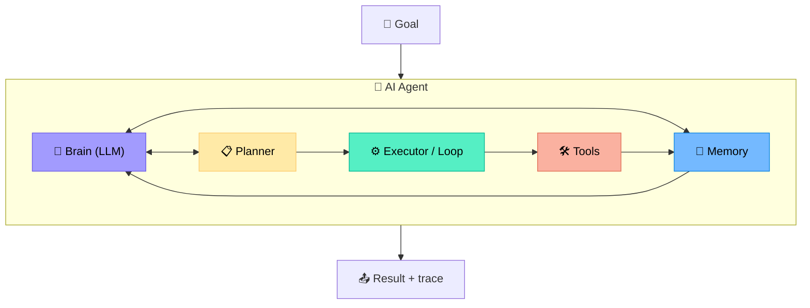
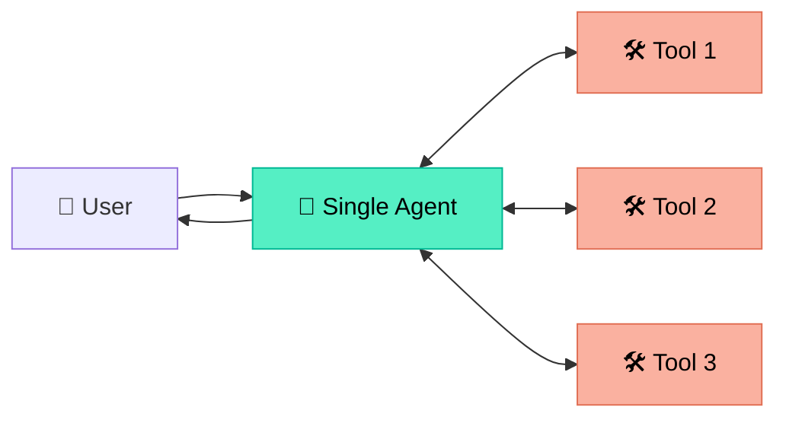
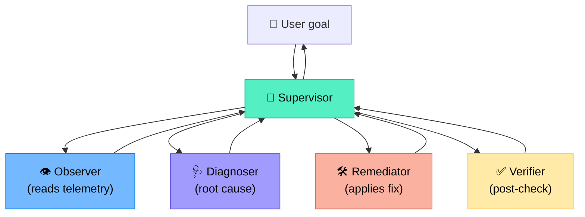
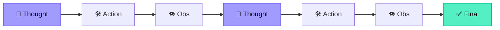
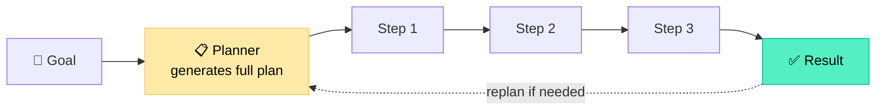
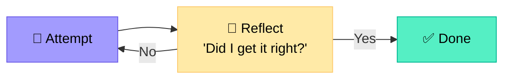
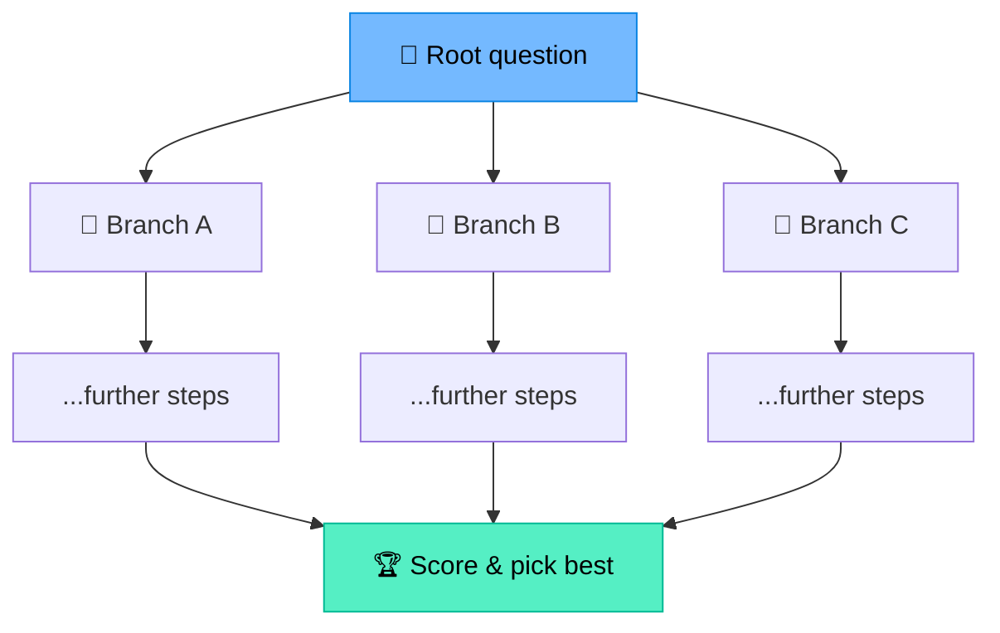
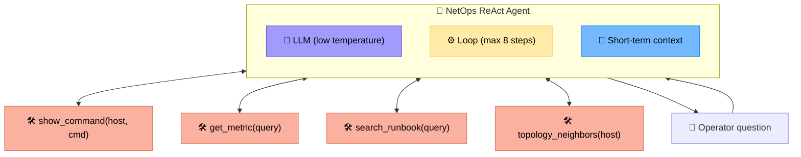
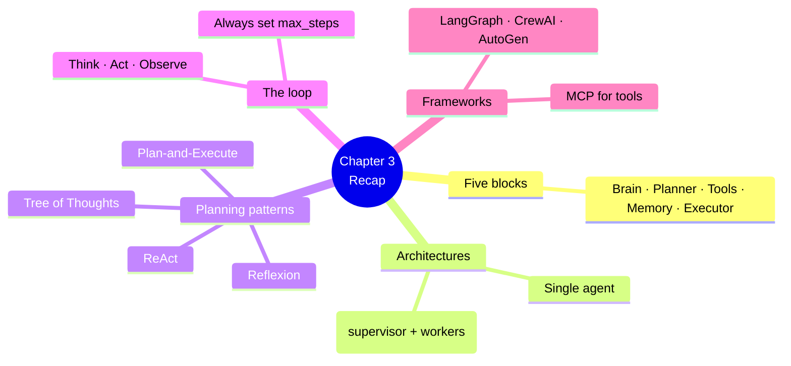

# Chapter 3 — Anatomy of an AI Agent

> **Learning objectives:** Identify the core components of an agent, distinguish single-agent vs. multi-agent architectures, recognise the main planning patterns (ReAct, Plan-and-Execute, Reflexion), understand agent loops, and survey today's agent frameworks.

---

## 3.1 The five core components

Every AI agent — no matter the framework — is built from the same five blocks:



| Block | Responsibility | Implementation |
|:--|:--|:--|
| **Brain (LLM)** | Reasoning, language understanding, generation | GPT-4, Claude, Llama, ... |
| **Planner** | Breaks a goal into ordered sub-tasks | Prompt template / explicit graph |
| **Tools** | External capabilities (read & write) | Python functions, APIs, MCP servers |
| **Memory** | State across steps and runs | Context window + vector DB + KV store |
| **Executor / Loop** | Orchestrates Think → Act → Observe | Framework code (LangGraph, AutoGen, ...) |

> The **executor** is the unsung hero. Without it, the LLM just produces text — the executor is what actually runs the tool calls, feeds results back, and decides when to stop.

---

## 3.2 Single-agent architecture

The simplest design: one LLM, one toolbox, one loop.



| Pros | Cons |
|:--|:--|
| Simple to build and debug | Tool list grows → prompt becomes huge |
| Cheaper (one LLM call per step) | Mixing concerns (diagnose + remediate + report) |
| Easy to trace | Hard to specialise behaviour per sub-task |

> **Good for:** Prototypes, narrow tasks (e.g. a BGP troubleshooting bot with 5 tools).

---

## 3.3 Multi-agent architecture

Specialised agents collaborate, each with its own role, prompt, and toolset.



| Pros | Cons |
|:--|:--|
| Specialisation → better quality per task | More moving parts, harder to debug |
| Each agent has a smaller toolset | More LLM calls → more cost & latency |
| Easier to upgrade one role at a time | Need an orchestration protocol |

> We'll cover multi-agent in depth in **Chapter 8**.

---

## 3.4 Planning patterns

### Pattern 1 — ReAct (Reason + Act)

The LLM decides the **next** action one step at a time. Already covered in Chapter 2.



**Best for:** Exploratory tasks where you don't know the full plan upfront (most troubleshooting).

---

### Pattern 2 — Plan-and-Execute

The LLM first produces a **full plan**, then executes it step by step.



**Best for:** Well-structured workflows (e.g. a network change with 10 known steps).

| ReAct | Plan-and-Execute |
|:--|:--|
| Decide step by step | Decide all steps upfront |
| Flexible, but can loop | Predictable, but rigid |
| One LLM call per step | One big LLM call, then small ones |

---

### Pattern 3 — Reflexion (self-critique)

The agent **reviews its own answer** and tries again if it's not good enough.



**Best for:** Tasks with a verifiable success criterion (e.g. "ping must succeed", "config must lint clean").

---

### Pattern 4 — Tree of Thoughts (ToT)

The agent explores **multiple branches** in parallel and picks the best.



**Best for:** Hard problems where greedy ReAct gets stuck. Expensive — use sparingly.

---

## 3.5 The agent loop in pseudo-code

```python
def run_agent(goal: str, tools: list, max_steps: int = 10):
    messages = [
        {"role": "system", "content": SYSTEM_PROMPT},
        {"role": "user",   "content": goal},
    ]
    for step in range(max_steps):
        response = llm.chat(messages=messages, tools=tools)
        if response.tool_calls:                    # 🛠️ Action
            for call in response.tool_calls:
                result = execute_tool(call.name, call.args)
                messages.append({"role": "tool",
                                 "name": call.name,
                                 "content": result})  # 👁️ Observation
        else:                                       # ✅ Final answer
            return response.content
    raise RuntimeError("Agent exceeded max_steps")
```

### Termination conditions

| Condition | Reason |
|:--|:--|
| LLM returns a final answer (no more tool calls) | Goal believed reached |
| `max_steps` reached | Safety net against infinite loops |
| A tool returns a fatal error | Cannot proceed |
| A guardrail trips (e.g. write to prod denied) | Safety |
| Human intervenes | HITL pause/abort |

> **Always** set `max_steps`. Without it, a buggy prompt can rack up thousands of dollars in API calls.

---

## 3.6 Agent frameworks landscape

| Framework | Language | Strengths | Best for |
|:--|:--|:--|:--|
| **LangGraph** (LangChain) | Python / JS | Graph-based, stateful, mature tracing | Multi-agent, production |
| **CrewAI** | Python | Role-based abstractions, easy to learn | Small teams of specialists |
| **AutoGen** (Microsoft) | Python | Conversational multi-agent | Research, complex chats |
| **Semantic Kernel** (Microsoft) | C# / Python | Enterprise, plugin model | .NET shops |
| **NeMo Agent Toolkit** (NVIDIA) | Python | NIM models, NetOps demos | NVIDIA-stack users |
| **OpenAI Assistants API** | HTTP API | Hosted, easy start | Quick prototypes |
| **MCP servers** (Anthropic) | Any | Standardised tool exposure | Tool/server marketplace |
| **Pydantic AI** | Python | Type-safe, validated I/O | Production reliability |

> Frameworks come and go. **Concepts persist.** Focus on the patterns (ReAct, tools, memory) — picking up a new framework then takes a weekend.

---

## 3.7 A reference agent for NetOps

Let's combine everything into a reference design for a **read-only network troubleshooting agent**.



We'll build this for real in Chapter 7.

---

## Summary



---

## Exercises

1. **Map a real bot.** Pick a chatbot you've used (e.g. ChatGPT with code interpreter). Identify its Brain, Tools, Memory, Executor.
2. **Single vs multi.** For each goal, choose single-agent or multi-agent and justify:
   - A. "Pull the BGP neighbor count from rtr-1."
   - B. "Investigate, remediate, and post-mortem a major outage."
   - C. "Summarise all interface errors across 500 devices."
3. **Pick a pattern.** Which planning pattern (ReAct / Plan-and-Execute / Reflexion / ToT) best fits:
   - A. Generating a YAML config from a template
   - B. Open-ended root-cause analysis
   - C. Validating that a generated ACL has no overlapping rules
4. **Termination design.** List 4 conditions besides `max_steps` that should stop your agent loop in a production setting.
5. **Framework choice.** Read the docs of LangGraph and CrewAI. In 5 lines each, summarise their core abstractions.
