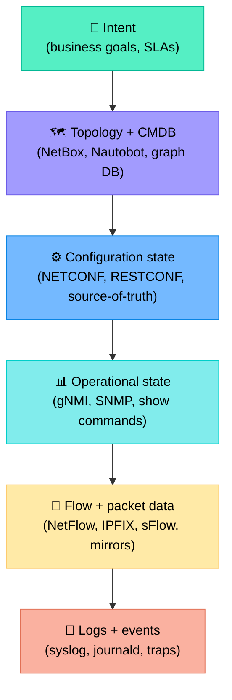
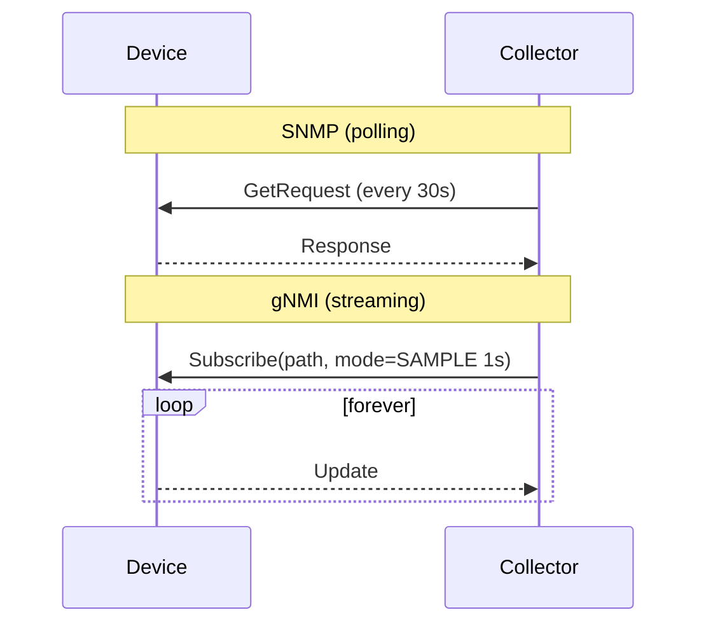
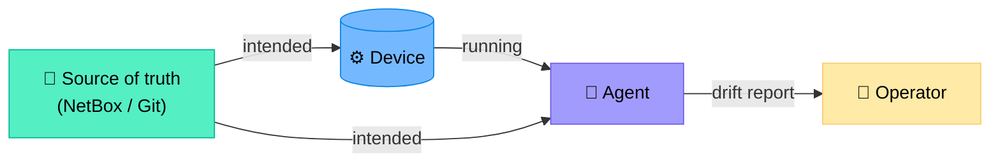
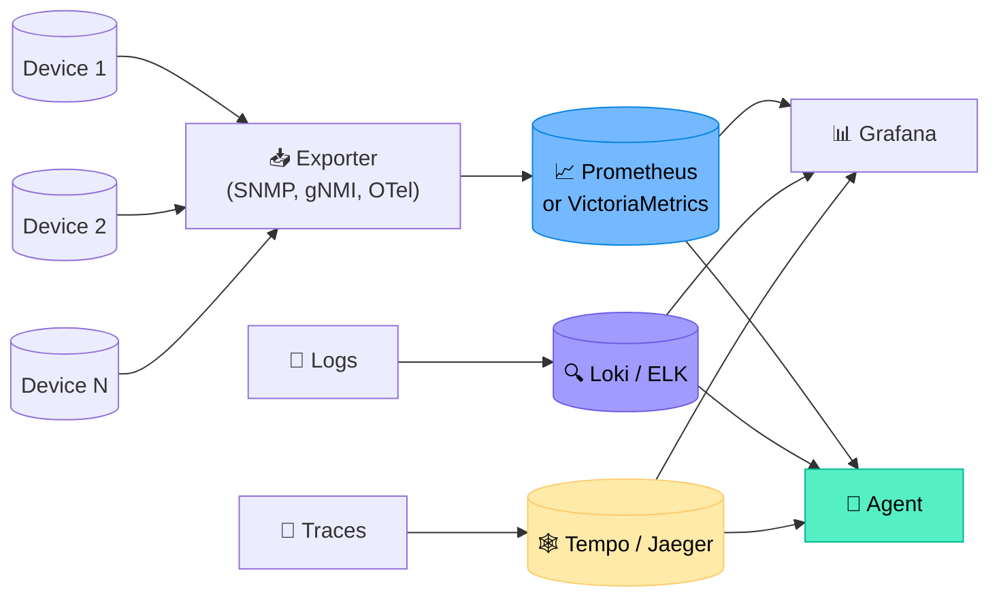
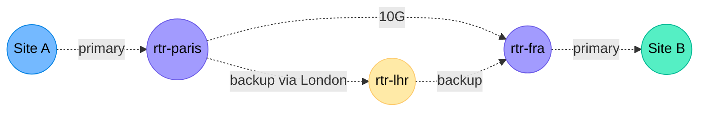
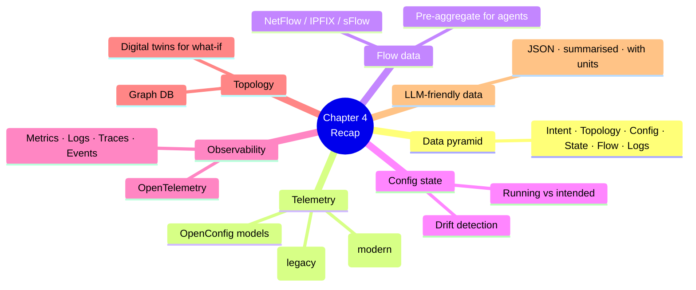

# Chapter 4 — Network Data Sources for Agents

> **Learning objectives:** Inventory the data sources an agent needs to operate a network, distinguish polling from streaming telemetry, understand configuration-state APIs, recognise observability building blocks, and prepare network data for LLM consumption.

---

## 4.1 The data pyramid of a modern network

An agent is only as good as the data it can read. Here is the typical hierarchy.



> **Rule of thumb:** Top of the pyramid = low volume, high meaning. Bottom = high volume, low meaning. Agents prefer the top whenever possible.

---

## 4.2 Telemetry: SNMP vs. streaming (gNMI)

### SNMP — the old workhorse

| Aspect | Detail |
|:--|:--|
| **Model** | Polling (manager pulls from agent) |
| **Encoding** | ASN.1 / BER |
| **Latency** | Seconds to minutes |
| **Scale** | Limited — polling thousands of devices is heavy |
| **Use today** | Legacy fleets, basic counters |

### gNMI / streaming telemetry — the modern way

| Aspect | Detail |
|:--|:--|
| **Model** | Subscribe (device pushes to collector) |
| **Encoding** | Protobuf over gRPC |
| **Latency** | Sub-second |
| **Scale** | Designed for tens of thousands of devices |
| **Use today** | Default for new deployments |



### OpenConfig — the standard data model

OpenConfig defines **vendor-neutral YANG models** for interfaces, BGP, system state, etc. Combined with gNMI, an agent can query `/interfaces/interface[name=Gi0/0/1]/state/counters/in-errors` on any compliant device.

---

## 4.3 Flow data: NetFlow, IPFIX, sFlow

Flow records summarise traffic at routers/switches. An agent uses them to answer "**who is talking to whom, and how much**".

| Protocol | Origin | Sampling | Use |
|:--|:--|:--|:--|
| **NetFlow v5** | Cisco | Full or 1:N | Legacy |
| **NetFlow v9 / IPFIX** | Cisco / IETF | Template-based, full or sampled | Modern, extensible |
| **sFlow** | sFlow.org | Always sampled (1:N) | High-speed switches |

### Anatomy of a flow record

| Field | Example |
|:--|:--|
| Source IP | 10.0.1.42 |
| Dest IP | 8.8.8.8 |
| Src port / Dst port | 51234 / 53 |
| Protocol | 17 (UDP) |
| Bytes / Packets | 89 / 1 |
| Start / End timestamp | t0 / t1 |
| Input / Output interface | Gi0/0/1 / Gi0/0/2 |

> **For agents:** Flow data is volume-heavy. Always pre-aggregate (e.g. top talkers per minute) before exposing to the LLM.

---

## 4.4 Configuration state and source-of-truth

| Source | What it stores | How agents read it |
|:--|:--|:--|
| **Running config** (device) | What is *actually* applied right now | NETCONF / RESTCONF / SSH |
| **Source-of-truth** (NetBox, Nautobot) | What *should* be configured | REST / GraphQL API |
| **Git** | Versioned intended configs | `git clone` + diff |



An agent that compares intended vs. running config is essentially detecting **config drift**.

### NETCONF vs. RESTCONF vs. gNMI

| Protocol | Transport | Encoding | Best for |
|:--|:--|:--|:--|
| NETCONF | SSH | XML | Bulk config push, transactions |
| RESTCONF | HTTPS | JSON or XML | Web-friendly, easy from Python |
| gNMI | gRPC | Protobuf | Read-heavy, streaming, high scale |

---

## 4.5 The observability stack

A modern agent typically queries a **time-series database** rather than the device directly.



### Three pillars (now four)

| Pillar | Example data | Agent use |
|:--|:--|:--|
| **Metrics** | `interface_in_errors_total` | Trends, anomalies |
| **Logs** | `BGP-3-NOTIFICATION ...` | Root cause |
| **Traces** | End-to-end request path | App-level perf |
| **Events** | "Link down at 14:02" | Timeline reconstruction |

### OpenTelemetry (OTel) — the common collector

OTel defines a vendor-neutral way to emit metrics/logs/traces. For agents, this is gold: **one query language and one schema** to learn.

---

## 4.6 Topology and digital twins

### Why topology matters

When site A can't reach site B, the agent needs to know the **path**: which routers, links, transits, peerings.

Storage options:

| Approach | Tool | Pros |
|:--|:--|:--|
| Relational (CMDB) | NetBox, Nautobot | Strong inventory, RBAC |
| Graph DB | Neo4j, ArangoDB | Path queries (`MATCH (a)-[:LINK*]->(b)`) |
| Digital twin | Batfish, Forward Networks | Simulate config changes safely |



A digital twin (e.g. Batfish) lets the agent **ask "what if?"** without touching production: *"If I drop the primary link, will site B still be reachable?"*

---

## 4.7 Structuring data for LLM consumption

LLMs are good with text, OK with JSON, weak with binary, and confused by huge unstructured blobs.

### Tips for tool output

| Do | Don't |
|:--|:--|
| Return **structured JSON** with named fields | Dump raw `show` output (often noisy) |
| **Pre-summarise** large results (top 10, last hour) | Send 50 MB of NetFlow records |
| Use **consistent units** (ms, Mbps, %) | Mix Kbps and Mbps |
| Include **timestamps and source** | Anonymous numbers |
| Truncate long strings with `... (truncated, total X bytes)` | Silently cut data |

### Before / after example

**Bad** (raw `show` output, ~5000 tokens):

```
GigabitEthernet0/0/1 is up, line protocol is up
  Hardware is Gi, address is 0001.0203.0405
  Description: WAN-to-Frankfurt
  Internet address is 10.0.0.1/30
  MTU 1500 bytes, BW 1000000 Kbit/sec, DLY 10 usec...
  [4900 more lines]
```

**Good** (pre-processed JSON, ~200 tokens):

```json
{
  "host": "rtr-paris-01",
  "interface": "Gi0/0/1",
  "description": "WAN-to-Frankfurt",
  "admin_status": "up",
  "oper_status": "up",
  "ipv4": "10.0.0.1/30",
  "bandwidth_mbps": 1000,
  "counters_last_5m": {
    "in_mbps_avg": 120,
    "out_mbps_avg": 95,
    "in_errors": 0,
    "crc_errors": 0,
    "input_drops": 0
  },
  "last_change": "2026-05-28T14:02:11Z",
  "source": "gnmi://rtr-paris-01"
}
```

> The second form costs ~25× fewer tokens and gives the LLM exactly what it needs.

---

## 4.8 Reference data catalogue for an agent

| Question the agent may ask | Best data source |
|:--|:--|
| "What is the current BGP state of neighbor X?" | gNMI / `show ip bgp` |
| "Are there interface errors in the last hour?" | Prometheus (gNMI counters) |
| "Has anyone changed the config of rtr-1 today?" | Git history of NetBox push |
| "Why is site B unreachable from site A?" | Topology graph + traceroute + Batfish |
| "What was the SLA last month?" | Long-term metrics store |
| "Were there alerts during the incident window?" | Alerts store (Alertmanager) |
| "What does runbook RB-117 say to do?" | Vector store (RAG) |

---

## Summary



---

## Exercises

1. **Pyramid mapping.** For each data point, place it on the pyramid: `bgp_session_state`, `customer_SLA`, `tcp_retransmits`, `device_role=spine`, `runbook_for_BGP_flap`.
2. **SNMP vs gNMI.** A team needs interface counters every 1 second on 5000 devices. Which protocol? Why?
3. **Drift design.** Sketch a flow that compares NetBox intended config with running config and emits a per-device diff JSON.
4. **Pre-summarise.** You have 24h of NetFlow (millions of records). Design a JSON summary (≤ 1 KB) suitable for an LLM that wants to answer *"Who are the top talkers today?"*.
5. **OpenTelemetry.** Why is OTel especially valuable for agents querying observability data?
6. **Digital twin.** Give two questions an agent could safely ask a Batfish digital twin that would be **unsafe** to ask production.
