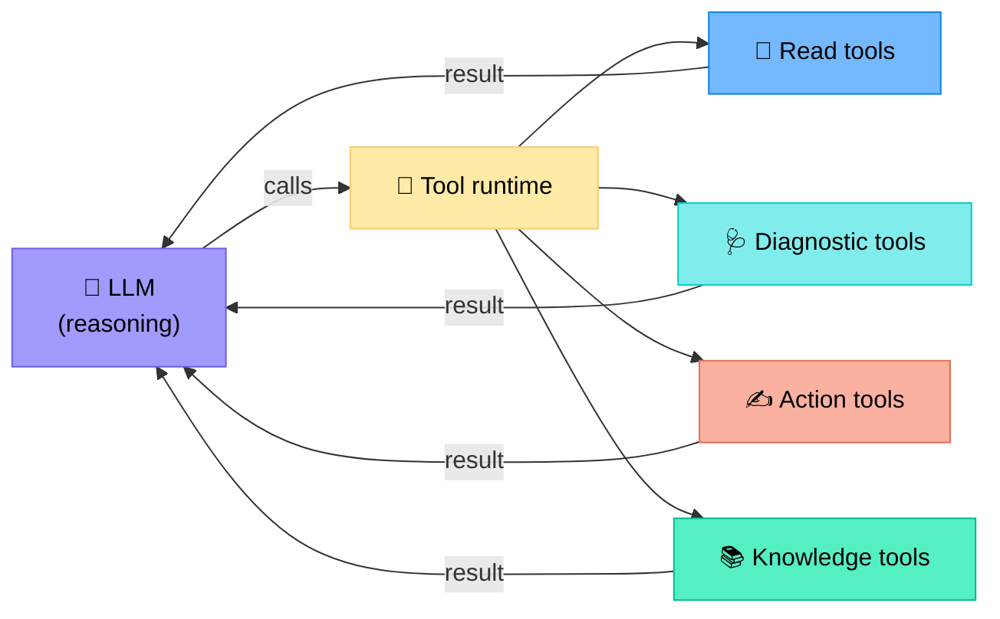
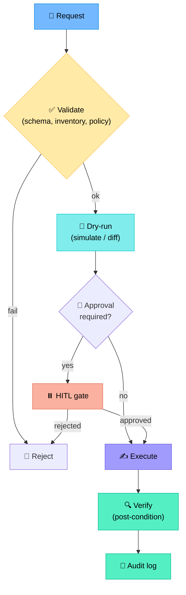
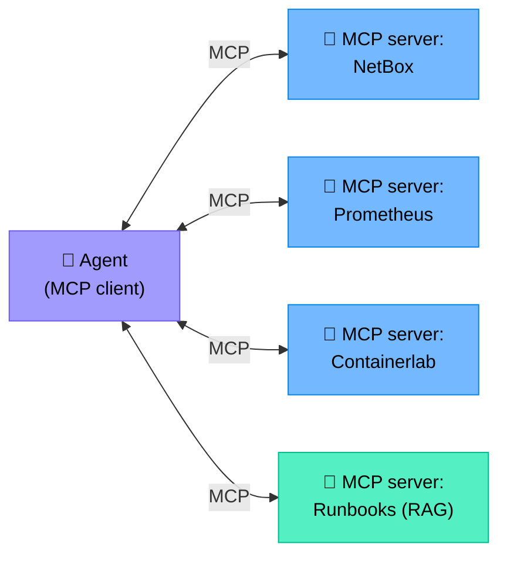
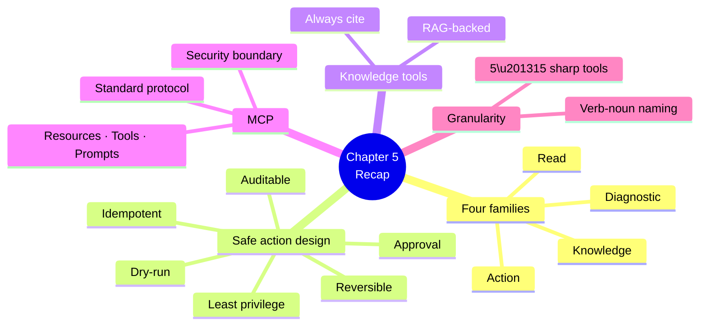

# Chapter 5 — Tools an Agent Needs

> **Learning objectives:** Classify the tools an agent uses (read, diagnostic, action, knowledge), design safe and idempotent tool wrappers, understand the Model Context Protocol (MCP), and know when to expose a capability as a tool vs. embed it in the agent.

---

## 5.1 Why tools are the agent's "hands"

An LLM alone can only produce text. **Tools** turn that text into action: querying a router, pushing a config, searching documentation. In ReAct terms, every `Action` is a tool invocation.



---

## 5.2 The four tool families

| Family | Side effects | Risk | Examples |
|:--|:--|:--|:--|
| **Read** | None | Low | `get_interface_state`, `get_bgp_neighbors`, `query_prometheus` |
| **Diagnostic** | Minor (CPU on device) | Low–Medium | `ping`, `traceroute`, `path_visualisation`, `tcpdump_sample` |
| **Action** | Changes state | **High** | `push_config`, `update_acl`, `shut_interface`, `restart_bgp` |
| **Knowledge** | None | Low | `search_runbook`, `search_rfc`, `search_design_docs` |

> **Golden rule:** Read and Knowledge tools can be invoked freely. Action tools must be guarded (least privilege, approval, dry-run).

---

## 5.3 Read-only tools

These are the agent's eyes. They should be **fast, cached when possible, and pre-summarised** (see §4.7).

### Example: `get_interface_state`

```python
def get_interface_state(host: str, interface: str) -> dict:
    """Return the operational state of an interface.

    Args:
        host: device hostname (must be in inventory)
        interface: e.g. 'Gi0/0/1'

    Returns:
        dict with admin_status, oper_status, counters_last_5m, source
    """
    ...
```

**Schema exposed to the LLM** (JSON Schema, OpenAI/Anthropic tool format):

```json
{
  "name": "get_interface_state",
  "description": "Return operational state of an interface (admin/oper status, recent counters).",
  "parameters": {
    "type": "object",
    "properties": {
      "host": {"type": "string", "description": "Device hostname from inventory"},
      "interface": {"type": "string", "description": "Interface name, e.g. Gi0/0/1"}
    },
    "required": ["host", "interface"]
  }
}
```

### Read-tool checklist

- ☑ Idempotent (same input → same output, modulo time)
- ☑ Returns structured JSON
- ☑ Times out (e.g. 10 s) instead of hanging
- ☑ Validates inputs (host in inventory, interface name shape)
- ☑ Includes `source` field for citation

---

## 5.4 Diagnostic tools

Diagnostic tools have *some* side effects (CPU on a device, packets on a link), but they don't change configuration.

| Tool | What it does | Watch out for |
|:--|:--|:--|
| `ping(target, count=5)` | ICMP reachability | Block lists, rate-limit |
| `traceroute(target)` | Path discovery | UDP/ICMP filtering |
| `path_analysis(src, dst)` | Multi-hop reachability w/ ECMP | Source-of-truth must match reality |
| `tcpdump_sample(host, iface, n=100)` | First N packets | **Privacy / data leakage** |
| `looking_glass(asn, prefix)` | Public BGP view | Rate limits |

### Anti-pattern: unbounded diagnostics

```python
# 🚫 BAD — could DoS a router
def ping(target, count=1_000_000): ...
```

```python
# ✅ GOOD — enforce limits
def ping(target: str, count: int = 5) -> dict:
    count = min(max(count, 1), 20)  # clamp
    ...
```

---

## 5.5 Action tools — design for safety

Action tools mutate state. Every action tool **must** implement the following pattern:



### The non-negotiables

| Property | Why |
|:--|:--|
| **Least privilege** | The tool's service account can only touch what it must |
| **Idempotent** | Re-invocation must not double-apply (`apply_acl_v3` → noop if already at v3) |
| **Dry-run** | Show the diff first; the LLM should always preview |
| **Approval gate** | High-blast-radius actions need a human (see Ch 9) |
| **Auditable** | Who/what/when/why logged immutably |
| **Reversible** | Provide a paired `rollback_*` or known recovery procedure |
| **Time-boxed** | The action commits after T seconds unless confirmed (`commit confirm`) |

### Example: scoped ACL update

```python
def update_acl(
    host: str,
    acl_name: str,
    new_rules: list[dict],
    dry_run: bool = True,
    ticket_id: str | None = None,
) -> dict:
    """Update a named ACL. Returns diff in dry-run mode, applies otherwise."""
    assert_in_inventory(host)
    assert_policy_allows(host, "acl_update")
    diff = compute_diff(host, acl_name, new_rules)
    if dry_run:
        return {"mode": "dry_run", "diff": diff}
    require_ticket(ticket_id)
    push_with_commit_confirm(host, render(new_rules), confirm_seconds=120)
    log_audit(host, "acl_update", acl_name, diff, ticket_id)
    return {"mode": "applied", "diff": diff}
```

---

## 5.6 Knowledge tools

Knowledge tools turn unstructured corpora into searchable answers. Most are backed by **RAG** (Chapter 6).

| Tool | Source |
|:--|:--|
| `search_runbook(query)` | Internal runbooks (Confluence, Git, Markdown) |
| `search_rfc(query)` | IETF RFCs |
| `search_vendor_docs(query, vendor)` | Cisco / Juniper / Arista docs |
| `search_past_incidents(query)` | Post-mortems, ticket history |

**Always return citations.** An answer without a source is, for an operator, useless.

```json
{
  "answer": "Run `clear ip bgp <neighbor> soft` to refresh routes without resetting the session.",
  "citations": [
    {"doc": "runbook-bgp.md", "section": "Soft reconfiguration", "url": "..."}
  ]
}
```

---

## 5.7 The Model Context Protocol (MCP)

**MCP** (Anthropic, 2024) is an open protocol that standardises how agents discover and invoke tools across vendors.



### Why MCP matters

| Without MCP | With MCP |
|:--|:--|
| Each framework reinvents tool wiring | One protocol, many clients |
| Vendors ship Python SDKs only | Vendors ship one MCP server, all agents benefit |
| Hard to swap LLM/framework | Servers are framework-agnostic |

### MCP primitives

| Primitive | Purpose |
|:--|:--|
| **Resources** | Read-only data the agent can fetch (files, configs) |
| **Tools** | Callable functions (read + action) |
| **Prompts** | Reusable prompt templates the server provides |

### Security note

An MCP server **is** an attack surface. Treat it as you would any privileged API: authentication, audit, network isolation. (Ch 12 covers this in depth.)

---

## 5.8 Tool granularity — too few or too many?

| Symptom | Cause | Fix |
|:--|:--|:--|
| LLM keeps "hallucinating" parameters | Tool too generic (`run_command(cmd)`) | Split into specific tools |
| Agent ignores half the toolbox | Too many tools (>30) overwhelm context | Group / sub-agent / dynamic selection |
| Same tool needs many follow-ups | Output too raw | Pre-summarise (§4.7) |
| Agent loops on the same tool | No memory of result | Use scratchpad / structured trace |

> **Practical sweet spot:** 5–15 well-named tools per agent. Beyond that, consider a multi-agent split (Ch 8).

### Naming conventions

Use verb-noun, lowercase, snake_case:

- ✅ `get_bgp_neighbors`, `list_interfaces`, `push_acl`
- ❌ `BGPStuff`, `do_it`, `helper2`

---

## 5.9 A reference toolbox for a NetOps agent

| Tool | Family | Description |
|:--|:--|:--|
| `list_devices(role?, site?)` | Read | Inventory query (NetBox) |
| `get_interface_state(host, interface)` | Read | gNMI snapshot |
| `get_bgp_neighbors(host)` | Read | BGP session table |
| `query_metrics(promql, range)` | Read | Prometheus query |
| `query_logs(query, range)` | Read | Loki / ELK |
| `ping(target, count=5)` | Diagnostic | ICMP reachability |
| `traceroute(target)` | Diagnostic | Path discovery |
| `path_analysis(src, dst)` | Diagnostic | Source-of-truth path simulation |
| `search_runbook(query)` | Knowledge | RAG over internal runbooks |
| `search_past_incidents(query)` | Knowledge | RAG over post-mortems |
| `update_acl(host, name, rules, dry_run=True)` | Action | Scoped ACL change |
| `shut_interface(host, interface, dry_run=True)` | Action | Disable interface |
| `open_ticket(summary, severity, evidence)` | Action | ITSM integration |

This list is intentionally short. The agent's reasoning power compounds with **fewer, sharper tools**.

---

## Summary



---

## Exercises

1. **Classify.** For each, name the family: `get_arp_table`, `roll_back_config`, `query_otel_traces`, `bounce_interface`, `find_rfc(query)`.
2. **Tool schema.** Write a JSON Schema for `query_metrics(promql, range)` suitable for Anthropic tool calling.
3. **Make it safe.** Take this signature: `def push_config(host, raw_config)` and add the six safety properties from §5.5.
4. **Granularity.** A junior engineer adds `run_show_command(host, cmd)` as a single catch-all tool. Argue for or against, and propose two replacements.
5. **MCP design.** Sketch the resources, tools and prompts you would expose from an MCP server wrapping a Containerlab topology.
6. **Audit trail.** Design the JSON record that the agent stores for every `update_acl` call (mandatory fields).
