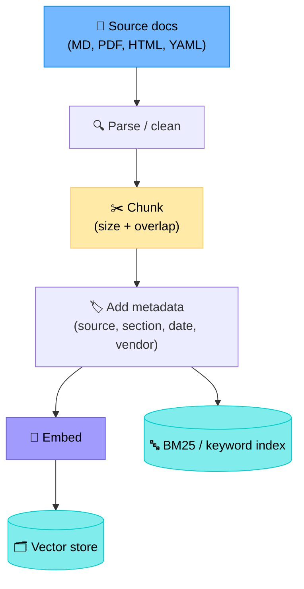
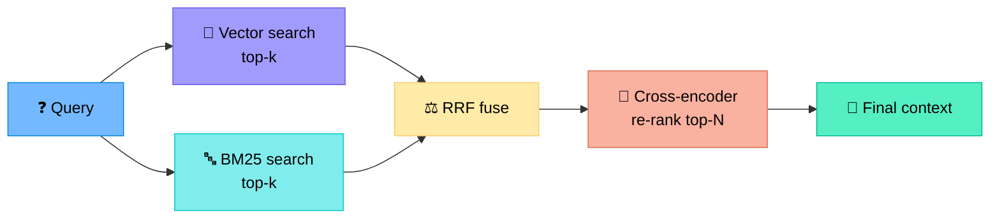
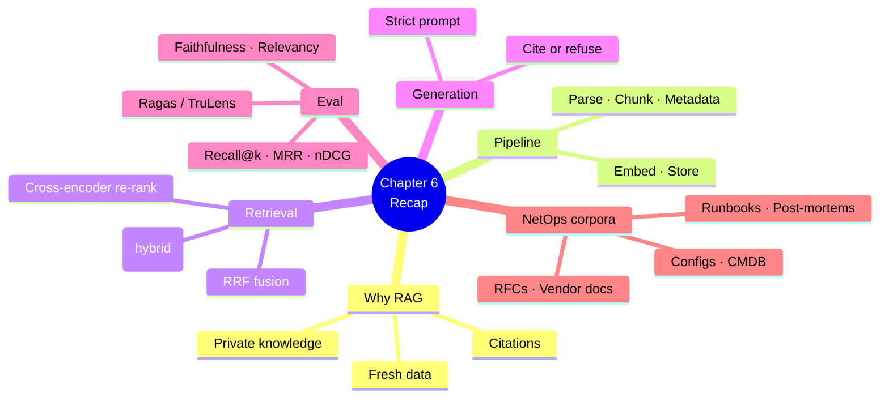

# Chapter 6 — Retrieval-Augmented Generation (RAG) for NetOps

> **Learning objectives:** Understand why RAG is essential for network agents, learn the embedding/vector-store pipeline, design indices for runbooks, RFCs and configs, apply hybrid search and re-ranking, and evaluate retrieval quality.

---

## 6.1 Why RAG?

LLMs know "the public internet up to a training cutoff". They do **not** know:

- Your runbooks
- Your topology
- Your incident history
- Yesterday's RFC update
- Your vendor's latest software release notes

**RAG** = give the LLM the right text snippets at runtime, with citations.


---

## 6.2 Embeddings — text as vectors

An **embedding model** turns a string into a vector (e.g. 1024 floats). Similar meanings → close vectors.

| Model | Dim | Notes |
|:--|--:|:--|
| `text-embedding-3-small` (OpenAI) | 1536 | Cheap, general |
| `text-embedding-3-large` (OpenAI) | 3072 | Better recall |
| `bge-large-en-v1.5` (BAAI) | 1024 | Open-source, strong |
| `nomic-embed-text` | 768 | Open, runs locally |

> **Distance metric:** almost always **cosine similarity**. Vectors are L2-normalised so dot product == cosine.

### Why text needs chunking

Documents are too long to embed as one vector. Split into **chunks** of ~200–800 tokens with **overlap** (50–100 tokens) so context is preserved at boundaries.

---

## 6.3 The RAG pipeline (indexing time)



### Chunking strategies

| Strategy | When | Example |
|:--|:--|:--|
| Fixed size (e.g. 500 tokens) | Generic text | Simple, often good enough |
| **Recursive split** by headings | Markdown / structured | `# > ## > paragraph` |
| **Semantic** (sentence groups) | Prose | NLP-based, slower |
| **Code/config-aware** | YAML, configs | Split at logical blocks (per neighbor, per interface) |

### Metadata that matters

| Field | Why |
|:--|:--|
| `source` (path/URL) | Citation |
| `section` / `heading` | Better re-ranking |
| `date` | Filter out stale docs |
| `vendor` / `os_version` | Vendor-specific answers |
| `doc_type` (runbook, RFC, post-mortem) | Type-aware retrieval |

---

## 6.4 Vector stores

| Store | Type | Best for |
|:--|:--|:--|
| **FAISS** | Library | Local prototypes |
| **Chroma** | Embedded DB | Small/medium, dev |
| **pgvector** | Postgres extension | Already have Postgres |
| **Qdrant**, **Weaviate**, **Milvus** | Dedicated DB | Production scale, filters |
| **OpenSearch / Elasticsearch (kNN)** | Hybrid | Combined with BM25 |

For NetOps, **filters** matter (`vendor=cisco AND doc_type=runbook`), so favour stores with strong metadata filtering (Qdrant, Weaviate, OpenSearch).

---

## 6.5 Query time: retrieve → re-rank → generate

### Step 1: Hybrid search

Pure vector search misses exact terms ("`BGP-3-NOTIFICATION`"). Pure keyword search misses paraphrases. **Hybrid = both**, fused with **Reciprocal Rank Fusion (RRF)**.

$$
\text{RRF}(d) = \sum_{r \in \text{rankers}} \frac{1}{k + \text{rank}_r(d)}
$$

with $k$ typically 60.



### Step 2: Cross-encoder re-rank

A small model (e.g. `bge-reranker-base`) scores `(query, chunk)` pairs more accurately than embedding cosine. Apply to top 30–50 candidates, keep top 5–10.

### Step 3: Generate with citations

Prompt template:

```
You are a network operations assistant. Use ONLY the context below.
If the answer is not in the context, say so.

Context:
[1] runbook-bgp.md > "Soft reconfiguration"
    "Use `clear ip bgp <neighbor> soft` to refresh..."
[2] RFC 4271 §8.2
    "..."

Question: How do I refresh BGP routes without dropping the session?

Answer (cite as [1], [2]):
```

---

## 6.6 What to index for a NetOps agent

| Corpus | Format | Refresh cadence |
|:--|:--|:--|
| Internal runbooks | Markdown / Confluence | On commit |
| Post-mortems / incident tickets | Markdown / Jira export | Daily |
| Network design docs (HLD/LLD) | PDF / Word | On change |
| Vendor docs (Cisco, Juniper, Arista) | HTML / PDF | Monthly |
| RFCs | TXT | Quarterly |
| Device config snapshots | YAML / text | Hourly (Git) |
| CMDB exports (NetBox) | JSON | Hourly |

> **Tip:** Keep separate **collections** per corpus. Route queries to the right collection (or use metadata filters) to avoid runbooks drowning RFCs.

---

## 6.7 Evaluating retrieval

You cannot improve what you do not measure. Build a small **golden set** of `(query, expected_doc_ids)` pairs from real tickets.

| Metric | Formula | What it tells you |
|:--|:--|:--|
| **Recall@k** | fraction of relevant docs in top-k | Are we *finding* the answer? |
| **MRR** (Mean Reciprocal Rank) | $\frac{1}{N}\sum \frac{1}{\text{rank}_i}$ | How high is the first relevant hit? |
| **nDCG@k** | normalised discounted cumulative gain | Quality of ordering |
| **Faithfulness** (LLM-judged) | answer grounded in cited chunks? | Hallucination check |
| **Answer relevancy** | does the answer address the question? | End-to-end quality |

Tools: **Ragas**, **TruLens**, **LangSmith eval**.

---

## 6.8 Failure modes and fixes

| Symptom | Likely cause | Fix |
|:--|:--|:--|
| Answer is right but cites wrong doc | Poor chunking, headings stripped | Recursive split keeping headings |
| Recall low for exact error codes | Pure vector, no keyword | Add BM25 → hybrid + RRF |
| Stale answers | No date filter | Index `date` metadata, filter `> now - 18 months` |
| Junk top results | Unrelated corpora mixed | Per-corpus collections + routing |
| LLM still hallucinates | Context not strict enough | Prompt: "If not in context, say 'I don't know'." |
| Long latency | Re-ranking too many | Reduce candidates to 30; cache embeddings |

---

## 6.9 RAG vs. fine-tuning vs. tools

| Need | Best approach |
|:--|:--|
| Inject **current** knowledge | RAG |
| Teach a **style** or **format** | Fine-tune (small adapter) |
| Get **live** state of a device | Tool (gNMI) |
| Cite a **source** | RAG |
| Reduce token cost of repeated prompts | Fine-tune or prompt caching |

> Often the right answer is **all three combined**: RAG for knowledge, tools for live state, fine-tune for output style.

---

## Summary



---

## Exercises

1. **Chunking choice.** A 200-page vendor PDF and a 30-line YAML config: pick a chunking strategy for each and justify.
2. **Hybrid maths.** Compute RRF (k=60) for document D ranked 3rd by vector search and 7th by BM25.
3. **Metadata design.** List the metadata fields you would attach to chunks from post-mortem reports, and one example query that uses each.
4. **Golden set.** Sketch 5 (query, expected_doc) pairs you would use to evaluate retrieval over your runbooks.
5. **Failure triage.** The agent answered "I don't know" although the runbook clearly covers the question. Name three possible causes.
6. **RAG or tool?** For each, decide: "what is the current uptime of rtr-paris-01?", "how should I respond to a BGP NOTIFICATION code 6?", "what is OSPF LSA type 5?".
