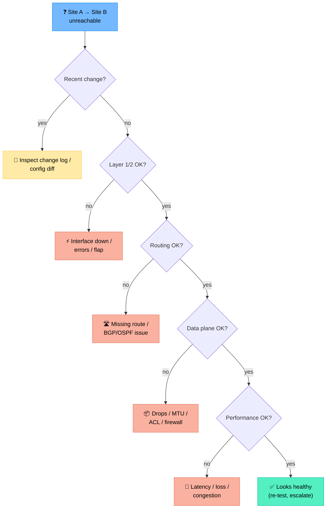
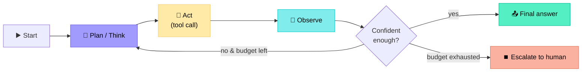
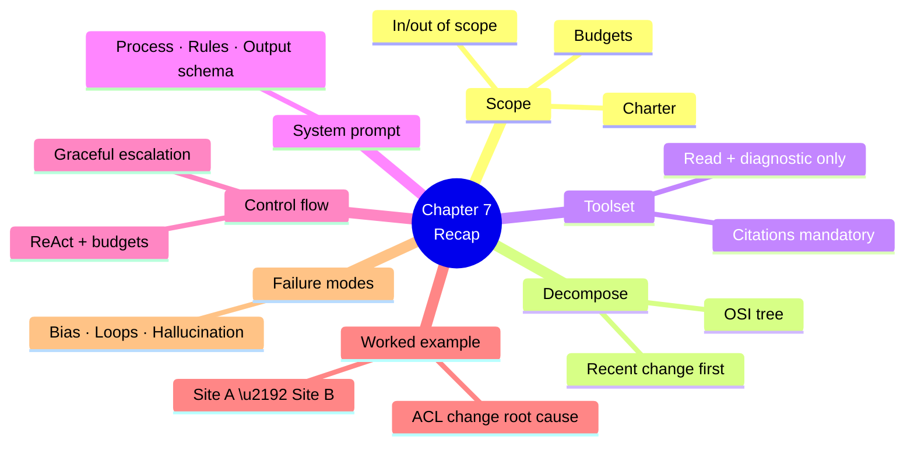

# Chapter 7 — Designing a Troubleshooting Agent

> **Learning objectives:** Walk through the end-to-end design of a network troubleshooting agent: scope, decomposition, toolset, prompt, control flow, and failure modes. Use a worked example — *"Why can't site A reach site B?"* — as the running thread.

---

## 7.1 Scope: define what the agent will (and won't) do

Before any code, write a one-page **agent charter**.

| Section | Example |
|:--|:--|
| **Goal** | Diagnose reachability and performance issues between two endpoints |
| **In scope** | Layer 3 reachability, routing, interface health, recent changes |
| **Out of scope** | Layer 7 app debugging, security incidents, capacity planning |
| **Inputs** | Source + destination (IP, hostname, or site code), optional time window |
| **Outputs** | Root cause hypothesis, evidence with citations, recommended next steps |
| **Allowed actions** | Read-only + diagnostic tools only (no writes) |
| **Approval model** | None needed (no writes); HITL gate before any remediation tool |
| **Targets** | Resolution suggestion in < 60s, < $0.05 per run |

> A clear charter prevents scope creep and makes evaluation possible.

---

## 7.2 Decompose the problem

A good troubleshooter follows a mental tree. Encode it as the agent's reasoning skeleton.



> This is a **diagnosis tree**, not a flowchart of code. The agent learns it via the system prompt and runbooks (RAG).

---

## 7.3 The toolset

Match the diagnosis tree to tools (see Ch 5).

| Question | Tool |
|:--|:--|
| Recent change? | `query_change_log(host?, since)` · `git_log(path, since)` |
| Layer 1/2 health? | `get_interface_state(host, iface)` · `query_metrics(...errors..., 1h)` |
| Path between A and B? | `path_analysis(src, dst)` · `traceroute(target)` |
| Routing OK? | `get_bgp_neighbors(host)` · `get_route(host, prefix)` |
| Data plane OK? | `ping(target)` · `query_acl(host, iface)` |
| Performance? | `query_metrics(latency,loss, 1h)` · `path_visualisation(src,dst)` |
| Runbook for the symptom? | `search_runbook(query)` · `search_past_incidents(query)` |

All read-only or diagnostic. Action tools are explicitly excluded by the charter.

---

## 7.4 System prompt (sketch)

```text
You are NetTriage, a senior network troubleshooting assistant.

GOAL
Diagnose reachability/performance issues between two endpoints
and produce: (1) a root-cause hypothesis, (2) supporting evidence
with citations, (3) recommended next steps.

PROCESS
1. Resolve src and dst to devices/interfaces using `list_devices`.
2. Check for recent changes in the last 24 h (`query_change_log`).
3. Walk the OSI stack bottom-up using the available tools.
4. Stop as soon as you have a high-confidence hypothesis.
5. ALWAYS cite the data that supports your conclusion.

RULES
- Use only the tools provided. Never invent device names or metrics.
- If a tool fails, retry once with corrected parameters, then move on.
- Do not propose configuration changes. Suggest them only as
  "next steps for a human operator".
- If evidence is inconclusive, say so and list what's missing.

OUTPUT (JSON)
{
  "hypothesis": "...",
  "confidence": 0.0-1.0,
  "evidence": [{"observation": "...", "source": "tool:..."}],
  "next_steps": ["...", "..."]
}
```

---

## 7.5 Control flow — ReAct with budgets



### Budgets

| Budget | Typical value | Why |
|:--|:--|:--|
| Max tool calls | 12 | Prevent runaway loops |
| Max tokens | 30k | Cost cap |
| Wall-clock | 60 s | UX |
| Per-tool retries | 1 | Don't hammer devices |

When a budget is hit → graceful escalation, not silent failure.

---

## 7.6 Worked example

**User:** *"Users at site A (paris-office) can't reach the file server at site B (frankfurt-dc, 10.20.5.10) since 14:00. What's wrong?"*

### Step-by-step trace

| # | Thought | Action | Observation (abridged) |
|--:|:--|:--|:--|
| 1 | Resolve endpoints | `list_devices(site="paris-office")` | `rtr-par-edge-01`, `sw-par-acc-01` |
| 2 | Resolve dest | `list_devices(site="frankfurt-dc")` | `rtr-fra-edge-01`, `srv-fra-files-01` |
| 3 | Recent changes? | `query_change_log(since="14:00")` | Change CHG-9821 at 13:58 on `rtr-par-edge-01`: ACL `OUT_INTERNET` updated |
| 4 | High suspicion: ACL change ~ symptom time | `query_acl(host="rtr-par-edge-01", name="OUT_INTERNET")` | New rule denies 10.20.0.0/16 → 10.20.5.0/24 |
| 5 | Confirm impact | `path_analysis(src="10.10.1.0/24", dst="10.20.5.10")` | Blocked at `rtr-par-edge-01` ACL `OUT_INTERNET` line 30 |
| 6 | Cross-check runbook | `search_runbook("ACL change reachability")` | Returns runbook RB-204 |
| 7 | Confident — finalise | — | — |

### Output

```json
{
  "hypothesis": "Reachability blocked by ACL change CHG-9821 on rtr-par-edge-01 at 13:58. New rule denies 10.20.0.0/16 -> 10.20.5.0/24.",
  "confidence": 0.92,
  "evidence": [
    {"observation": "Change CHG-9821 at 13:58 modified ACL OUT_INTERNET", "source": "tool:query_change_log"},
    {"observation": "ACL line 30 denies 10.20.0.0/16 -> 10.20.5.0/24", "source": "tool:query_acl"},
    {"observation": "path_analysis confirms drop at rtr-par-edge-01 ACL line 30", "source": "tool:path_analysis"}
  ],
  "next_steps": [
    "Verify CHG-9821 intent with the requester (likely misconfigured)",
    "Roll back ACL OUT_INTERNET to pre-change revision",
    "Re-run path_analysis after rollback"
  ]
}
```

> Notice: the agent stopped at 6 tool calls (under budget), did not propose a write, and cited every claim.

---

## 7.7 Failure modes and mitigations

| Mode | Cause | Mitigation |
|:--|:--|:--|
| **Confirmation bias** | Agent fixates on first hypothesis | Force "list 2 alternative hypotheses" in prompt |
| **Tool hallucination** | Made-up device name | Strict input validation; fail loudly |
| **Loop on same tool** | No memory of prior calls | Structured trace; deduplicate calls |
| **Drowning in data** | Raw `show` dumps | Pre-summarise tool outputs (Ch 4) |
| **False high confidence** | LLM overstates certainty | Calibrate via eval; require evidence count > N for confidence > 0.8 |
| **Silent escalation failure** | Budget hit without alerting | Always emit a structured "escalated" envelope |

---

## 7.8 Putting it together — implementation skeleton

```python
# Pseudo-code: a LangGraph / minimal agent loop

state = {
    "messages": [system_prompt, user_query],
    "tool_calls": [],
    "budget": {"calls": 12, "tokens": 30_000, "wall_s": 60},
}

while True:
    if budget_exhausted(state):
        return escalate(state, reason="budget")

    decision = llm.invoke(state["messages"])  # may emit tool_calls

    if decision.is_final:
        return finalise(decision, state)

    for call in decision.tool_calls:
        if not in_allowlist(call.tool):
            return escalate(state, reason="disallowed_tool")
        result = run_tool(call.tool, call.args)  # with timeout + retry=1
        state["tool_calls"].append({"call": call, "result": summarise(result)})
        state["messages"].append(tool_message(call, result))
```

Key points:

- **Allow-list** the tools (never trust the LLM to pick anything outside it)
- **Summarise** tool output before re-feeding it to the LLM
- **Persist** the full trace (for eval and audit)

---

## Summary



---

## Exercises

1. **Charter writing.** Draft a one-page charter for an agent diagnosing Wi-Fi roaming issues in a campus.
2. **Tree to tools.** Map each branch of a "high latency between two sites" tree to specific tools.
3. **Prompt critique.** Find three weaknesses in the system prompt of §7.4 and rewrite them.
4. **Trace analysis.** Given a trace where the agent calls `path_analysis` 5 times in a row with the same args, what failed and how do you fix it?
5. **Calibration.** Propose a rule that prevents the agent from outputting `confidence > 0.9` without at least two independent pieces of evidence.
6. **Escalation envelope.** Design the JSON returned when the agent escalates due to inconclusive evidence.
