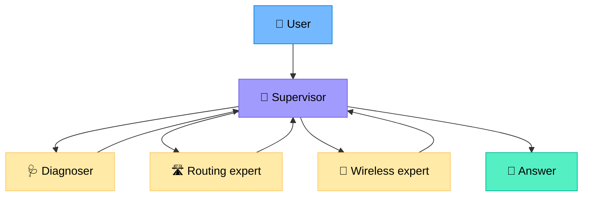
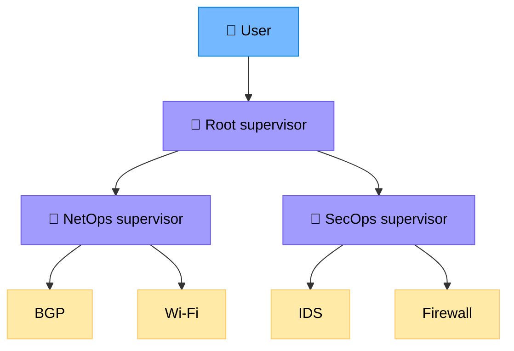
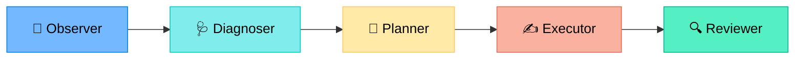
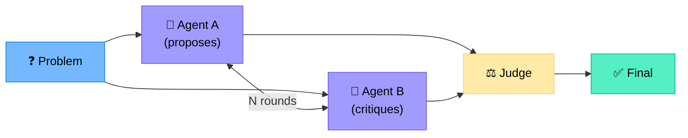
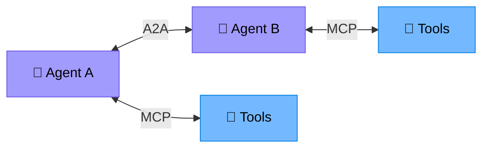
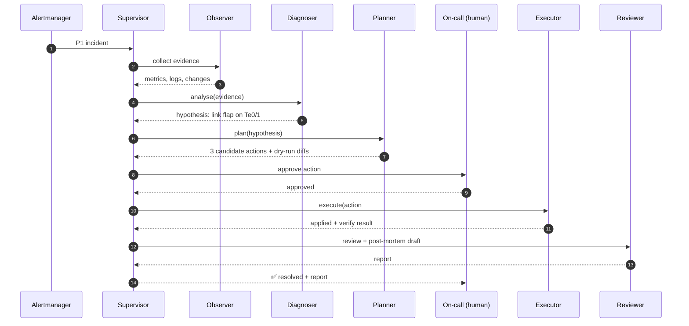
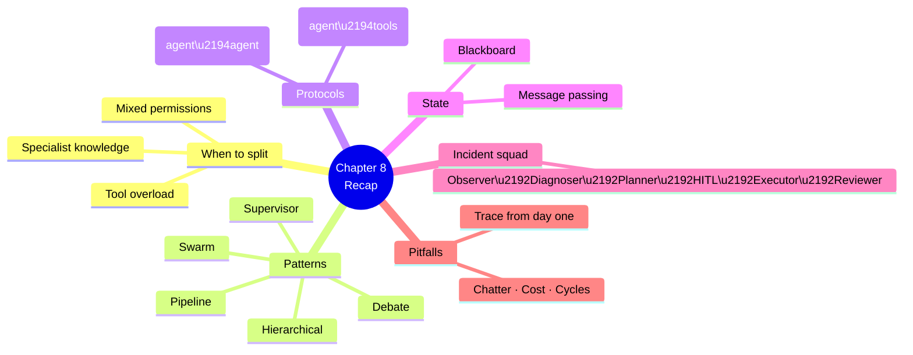

# Chapter 8 — Multi-Agent Architectures

> **Learning objectives:** Recognise when one agent is not enough, learn the canonical orchestration patterns (supervisor, hierarchical, swarm, pipeline), understand agent-to-agent protocols, and apply them to a network incident-response squad.

---

## 8.1 When one agent isn't enough

| Symptom of single-agent overload | Why |
|:--|:--|
| Toolbox > 20 tools | Context bloat, poor tool selection |
| Mixed responsibilities (read + write + report) | Different safety/permission profiles |
| Long-running multi-stage tasks | Context window pressure |
| Different specialised knowledge (BGP, Wi-Fi, security) | Different system prompts / RAG corpora |
| Parallel sub-tasks | One agent works serially |

A multi-agent system splits these along **role**, **skill**, or **phase** boundaries.

---

## 8.2 Canonical patterns

### 8.2.1 Supervisor (orchestrator + workers)



A **supervisor LLM** decides which specialist to call, aggregates results, decides when to stop. Workers don't talk to each other directly.

| Pros | Cons |
|:--|:--|
| Clear control flow | Supervisor is the bottleneck |
| Easy to add specialists | Extra LLM call per hop |
| Per-worker permissions | Risk of "supervisor knows nothing" |

> Frameworks: **LangGraph supervisor**, **CrewAI hierarchical**, **AutoGen GroupChatManager**.

### 8.2.2 Hierarchical (supervisors of supervisors)



For large orgs. Each domain has its own toolset, RAG corpus, and policy.

### 8.2.3 Pipeline (sequential)



Each stage has a single, well-defined output. Excellent for **closed-loop automation** (Ch 10).

### 8.2.4 Swarm / network (peer-to-peer)

Agents pass control to each other directly based on the next required skill. No central supervisor.

| Pros | Cons |
|:--|:--|
| No bottleneck | Harder to reason about |
| Naturally dynamic | Harder to debug / audit |
| Scales horizontally | Risk of cycles / livelock |

### 8.2.5 Debate / critique

Two or more agents argue. A judge picks the best answer. Useful for high-stakes diagnoses.



### Choosing a pattern

| Need | Pattern |
|:--|:--|
| Mix of specialist skills, controlled cost | **Supervisor** |
| Many domains, large org | **Hierarchical** |
| Repeatable multi-phase workflow | **Pipeline** |
| Dynamic, hand-off rich | **Swarm** |
| Maximise correctness on hard problems | **Debate** |

---

## 8.3 Agent-to-Agent (A2A) communication

Agents need a shared message format. Two emerging standards:

| Protocol | Origin | Idea |
|:--|:--|:--|
| **A2A** (Google, 2024) | Open | Agents discover each other via "Agent Cards" and exchange tasks |
| **MCP** (Anthropic) | Open | Tool/data plane — often combined with A2A |

A clean architecture: **A2A between agents, MCP between agent and tools.**



### Message envelope (illustrative)

```json
{
  "from": "diagnoser",
  "to": "routing_expert",
  "task_id": "incident-2026-04-12-001",
  "intent": "analyse_bgp",
  "payload": {
    "host": "rtr-par-edge-01",
    "neighbor": "10.0.0.2",
    "window": "last_30m"
  },
  "context": {"correlation_id": "...", "trace_id": "..."}
}
```

---

## 8.4 Shared state: blackboard vs. message passing

| Model | How it works | When |
|:--|:--|:--|
| **Message passing** | Each agent receives only what it needs | Loose coupling, smaller context |
| **Blackboard** | All agents read/write a shared state | Strong coordination, easy debugging |

LangGraph uses a typed **shared state** (TypedDict) — effectively a blackboard. CrewAI/AutoGen lean message-passing. Pick based on team familiarity and audit needs.

---

## 8.5 Worked example — incident-response squad

**Scenario:** P1 alert at 02:14 — multiple BGP sessions flapping on `rtr-par-edge-01`.

### Squad composition

| Agent | Role | Tools (highlights) |
|:--|:--|:--|
| **Observer** | Pull all evidence (metrics, logs, recent changes) | `query_metrics`, `query_logs`, `query_change_log` |
| **Diagnoser** | Form hypothesis, rank causes | `path_analysis`, RAG (`search_past_incidents`) |
| **Planner** | Propose remediation steps + impact | `dry_run_*`, RAG (`search_runbook`) |
| **Approver** (HITL) | Human on-call | UI in Slack |
| **Executor** | Apply approved steps | `commit_*` (action tools, scoped) |
| **Reviewer** | Verify outcome, write post-mortem draft | `query_metrics`, RAG |

### Flow



### Why this is more robust than one mega-agent

| Property | Benefit |
|:--|:--|
| Observer is read-only | Cheap, parallelisable, cacheable |
| Diagnoser is stateless w.r.t. tools | Easy to A/B different models |
| Planner outputs **diffs only** | Reviewer can validate before any change |
| Executor has a tiny tool list | Smallest possible blast radius |
| Reviewer closes the loop | Built-in eval signal |

---

## 8.6 Pitfalls

| Pitfall | Mitigation |
|:--|:--|
| **Chatter explosion** | Cap rounds; enforce structured outputs |
| **Cost blow-up** | Use a small/cheap model for the supervisor; large for diagnosers only |
| **Lost context between agents** | Pass a **summary**, not the full transcript |
| **Permission leakage** | Each worker has its own minimal toolset and credentials |
| **Hidden cycles** | Add explicit hop limits and trace IDs |
| **Hard to debug** | Use a tracing tool (LangSmith, Phoenix, OTel) from day one |

---

## 8.7 Cost & latency model

For a supervisor + N workers:

$$
\text{cost} \approx C_{\text{sup}} \cdot R + \sum_{i=1}^{N} C_i \cdot k_i
$$

where $R$ = supervisor rounds, $k_i$ = times worker $i$ is called. Two easy wins:

1. **Cheap supervisor** (e.g. small model) — it mostly routes.
2. **Cap rounds** — most useful work happens in the first 2–3 hops.

---

## Summary



---

## Exercises

1. **Pick a pattern.** For each, choose: (a) Wi-Fi roaming RCA across a campus, (b) nightly compliance audit, (c) live P1 incident response. Justify.
2. **Squad design.** Sketch a 4-agent squad for "automated certificate renewal across 500 devices".
3. **A2A envelope.** Add three fields to the envelope in §8.3 to support better observability.
4. **Cost math.** With $C_{sup}=\$0.001$/round, $R=5$, two workers at $C_1=\$0.02$, $C_2=\$0.04$ called 3 and 2 times — total cost?
5. **Failure injection.** The planner returns an empty plan. How should the supervisor react? Write the rule.
6. **Debate.** Give one networking scenario where a debate pattern is worth the extra cost.
