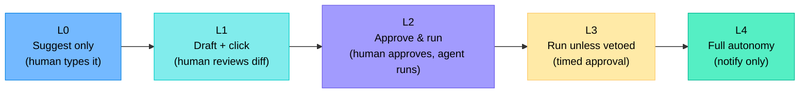
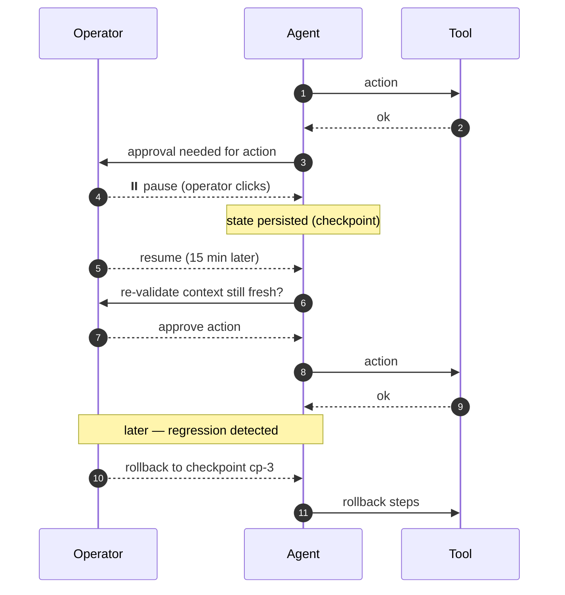
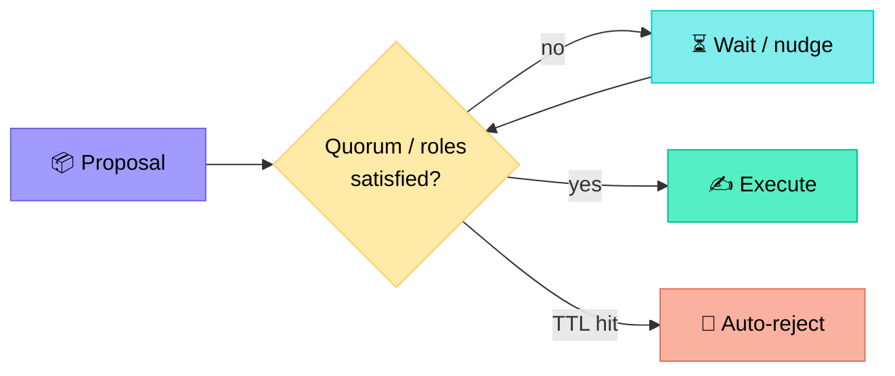
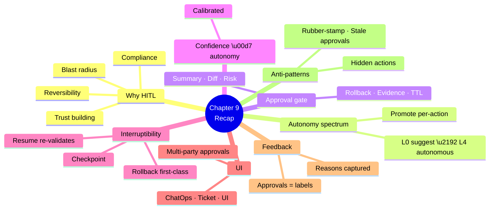

# Chapter 9 — Human-in-the-Loop (HITL) and Approval Workflows

> **Learning objectives:** Understand why humans stay in the loop even with capable agents, design approval gates and confidence thresholds, support pause/resume/rollback, and integrate with the tools operators already use (Slack, ServiceNow, Jira).

---

## 9.1 Why humans stay in the loop

Even a capable agent must defer to humans when:

| Reason | Example |
|:--|:--|
| **Blast radius** | Pushing a BGP policy that affects all peers |
| **Reversibility** | A change that can't be `commit confirm`'d easily |
| **Ambiguity** | Two equally plausible root causes |
| **Cost** | High-€ remediation (calling a field engineer) |
| **Compliance** | Change-management policy requires approval |
| **Trust building** | New agent — gather operator feedback |

> HITL is **not** a sign of weakness. It is the contract that allows automation to expand over time.

---

## 9.2 The autonomy spectrum



| Level | Best for | Risk |
|:--|:--|:--|
| **L0–L1** | New agents, high-blast actions | Slow but safest |
| **L2** | Routine, scoped actions | Default |
| **L3** | Repetitive ops with track record | Needs robust veto path |
| **L4** | Low-risk, reversible, well-tested | Requires strong eval + monitoring |

Start every action tool at L1–L2. Promote per-action only after evidence (see Ch 11, Ch 14).

---

## 9.3 Designing an approval gate

A good gate has six parts.

```mermaid
flowchart LR
    P["📦 Proposed action<br/>(by agent)"] --> SU["📝 Summary<br/>(plain English)"]
    SU --> DF["🔍 Diff / dry-run"]
    DF --> RB["⚠️ Risk + blast radius"]
    RB --> RU["📋 Rollback plan"]
    RU --> CI["📑 Citations / evidence"]
    CI --> AC["✅ Approve · ✏️ Edit · 🚫 Reject"]

    style P fill:#a29bfe,stroke:#6c5ce7,color:#000
    style SU fill:#74b9ff,stroke:#0984e3,color:#000
    style DF fill:#81ecec,stroke:#00cec9,color:#000
    style RB fill:#fab1a0,stroke:#e17055,color:#000
    style RU fill:#ffeaa7,stroke:#fdcb6e,color:#000
    style CI fill:#55efc4,stroke:#00b894,color:#000
    style AC fill:#55efc4,stroke:#00b894,color:#000
```



### Example payload

```json
{
  "action_id": "act-2026-04-12-001",
  "summary": "Roll back ACL OUT_INTERNET on rtr-par-edge-01 to revision r37 to restore Site A → Site B reachability.",
  "diff": "- 30 deny 10.20.0.0/16 10.20.5.0/24\n+ 30 permit 10.20.0.0/16 10.20.5.0/24",
  "risk": "low",
  "blast_radius": ["rtr-par-edge-01"],
  "rollback": "Re-apply current revision r38 within 5 min via commit confirm.",
  "evidence": [
    "change CHG-9821 caused the regression at 13:58",
    "path_analysis confirms drop at line 30"
  ],
  "ttl_seconds": 300
}
```

The TTL forces a fresh decision if humans don't answer in time — stale approvals are dangerous.

---

## 9.4 Confidence thresholds

Couple **confidence** to **autonomy**:

| Confidence | Action class | Autonomy |
|:--|:--|:--|
| < 0.4 | Any | Suggest only (L0–L1) |
| 0.4 – 0.7 | Read | Auto · Action → L2 |
| 0.7 – 0.9 | Read/diag → auto · Action → L2 | |
| > 0.9 | Low-risk action | L3 (timed veto) |
| Any | High-blast (multi-device) | Always ≥ L2 |

> Confidence is only useful if **calibrated** — see Ch 11 for measurement.

---

## 9.5 Pause / resume / rollback

A long-running agent must be **interruptible**.



### Engineering requirements

| Requirement | How |
|:--|:--|
| Checkpoint state | Persist (state, messages, tool_calls) after each action |
| Stable IDs | Each action / checkpoint has a UUID |
| Re-validate on resume | Re-fetch live state; abort if drift |
| Rollback first-class | Every action declares its inverse |
| Idempotent re-runs | Resuming should not double-apply |

> Frameworks supporting interruptible agents: **LangGraph** (checkpointer), **Temporal** (workflow engine), custom state stores (Redis/SQL).

---

## 9.6 Where humans live — UI patterns

| Channel | When | Strengths |
|:--|:--|:--|
| **ChatOps (Slack, Teams)** | Live incident, quick approvals | Real-time, social, ephemeral history |
| **Ticket (ServiceNow, Jira)** | Change requests, post-incident | Audit, SLA, RBAC |
| **Dedicated UI** | High-stakes, complex diffs | Rich rendering, side-by-side |
| **Email** | Asynchronous, regulatory | Slow, weak interactivity |
| **PagerDuty / OpsGenie** | After-hours, escalation | Reliable delivery |

### Slack approval — concrete example

```
🤖 NetTriage — approval requested
Action: Roll back ACL OUT_INTERNET on rtr-par-edge-01
Risk: low · Blast radius: 1 device
Diff:
- 30 deny 10.20.0.0/16 10.20.5.0/24
+ 30 permit 10.20.0.0/16 10.20.5.0/24
Evidence: CHG-9821 caused outage at 13:58 (link)
Rollback: re-apply r38 within 5 min
[ ✅ Approve ]  [ ✏️ Edit ]  [ 🚫 Reject ]   ⏱ expires in 5 min
```

Always log the decision (who, when, what) immutably.

---

## 9.7 Multi-party approval

Some changes need **two-person approval** (4-eyes principle) or role-specific approval.

| Pattern | Use |
|:--|:--|
| Single approver | Routine, low risk |
| 2-of-2 (peer + manager) | Production change |
| 2-of-N quorum | Distributed teams |
| Role-gated (e.g. SecOps must approve ACL changes) | Cross-domain impact |



---

## 9.8 Feedback loops — humans as a training signal

Every approval, edit, or rejection is **labelled data**.

| Signal | Use |
|:--|:--|
| **Approved as-is** | Positive example |
| **Edited then approved** | Diff = correction signal (great for fine-tuning / prompt tweaking) |
| **Rejected** | Negative example; capture *why* (free text + reason code) |
| **Rollback triggered** | Strong negative signal |

Feed these into your eval dataset (Ch 11) and your improvement loop (Ch 14).

---

## 9.9 Anti-patterns

| Anti-pattern | Why bad | Fix |
|:--|:--|:--|
| "Always approve" button | Defeats the gate | Remove; require explicit per-action approval |
| Walls of raw config in Slack | Operator can't really read | Send summary + link to side-by-side diff |
| No TTL on approvals | Stale context, dangerous | Force expiry + re-validation |
| Hidden auto-actions ("low risk so we just did it") | Trust erosion | Always log + notify |
| Approval fatigue | Operators rubber-stamp everything | Tighten what needs approval; batch sensibly |
| No audit trail | Compliance + post-mortem nightmare | Immutable log: who/what/when/why |

---

## Summary



---

## Exercises

1. **Autonomy mapping.** Place these actions on the L0–L4 spectrum: (a) restart a single WAN BGP neighbor, (b) push a new ACL fleet-wide, (c) raise an incident ticket, (d) clear ARP on one interface.
2. **Gate payload.** Build the approval payload (per §9.3) for "shut interface Gi0/0/2 on sw-par-acc-07".
3. **Threshold rule.** Write the decision rule combining confidence and blast radius from §9.4.
4. **Resume safety.** Operator resumes an approval 4 hours later. List three checks the agent must do before executing.
5. **Slack UX.** Re-design the message in §9.6 for an action with a 200-line diff.
6. **Feedback loop.** A rejection always logs `reason="other"`. Suggest a structured reason taxonomy with 5–7 codes.
