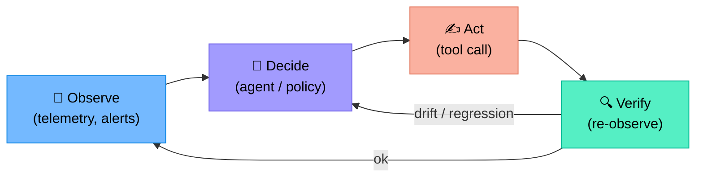
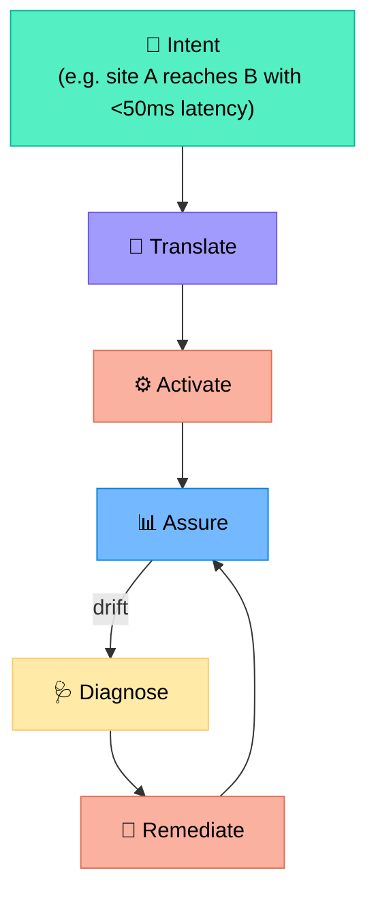
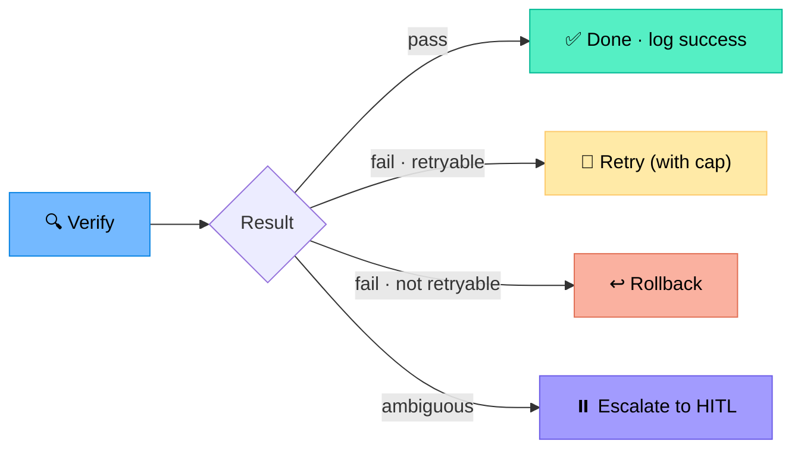
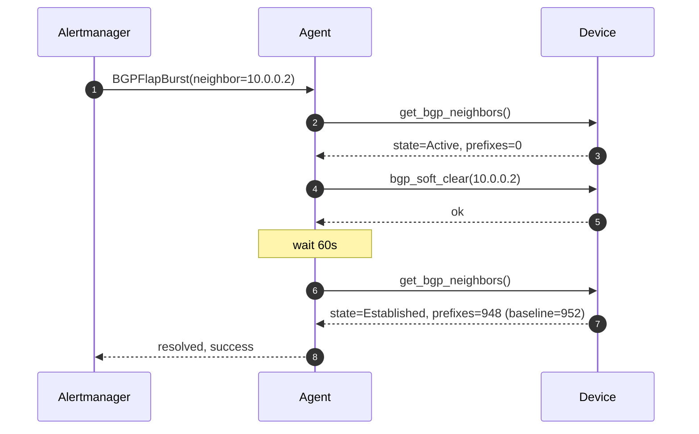
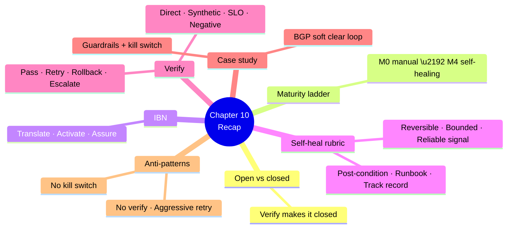

# Chapter 10 — Closed-Loop Automation

> **Learning objectives:** Distinguish open vs. closed loops, understand the observe→decide→act→verify cycle, recognise the intent-based networking (IBN) vision, identify when self-healing is appropriate, and walk through a BGP-flap closed-loop case study.

---

## 10.1 Open loop vs. closed loop

| Open loop | Closed loop |
|:--|:--|
| Run an action, hope it worked | Run, **measure**, decide whether to retry, rollback, or escalate |
| Static automation (cron + script) | Adaptive (agent + telemetry) |
| Failures detected later by humans | Failures detected by the loop itself |

> The verify step is what makes it "closed". Without it, you have automation; with it, you have control theory.

---

## 10.2 Maturity ladder

| Level | What | Example |
|:--|:--|:--|
| **M0** | Operator types commands | Manual ACL update |
| **M1** | Script run by ops | Ansible playbook on schedule |
| **M2** | Agent proposes, human approves | Ch 9 patterns |
| **M3** | Agent acts autonomously on scoped, reversible actions | Auto-clear ARP, restart specific neighbor |
| **M4** | Network continuously reconciles to intent | "Maintain SLA of 99.99% between sites A & B" |

Promote per-action class, not blanket — your monitoring + rollback maturity defines the ceiling.

---

## 10.3 Intent-Based Networking (IBN)

Three pillars:

| Pillar | Meaning |
|:--|:--|
| **Translation** | Business intent → low-level config |
| **Activation** | Push config, atomic where possible |
| **Assurance** | Continuously verify intent is met; remediate if not |

> Agents are the natural engine for Translate, Diagnose, and Remediate. The "intent" itself is usually a structured policy (YAML/DSL), not free text.

---

## 10.4 When self-healing is appropriate

Apply this rubric **per action**:

| Question | Required answer |
|:--|:--|
| Is it reversible quickly (< minutes)? | Yes |
| Is the blast radius bounded (1 device, 1 link)? | Yes |
| Is the detection signal reliable (low false-positive)? | Yes |
| Is there a clear post-condition to verify success? | Yes |
| Is the action documented in a runbook? | Yes |
| Have we run it 100+ times with HITL approval with > 95 % success? | Yes |

All "Yes" → candidate for closed loop. Any "No" → keep at L2 (HITL).

---

## 10.5 The verify step — done right

A closed loop is only as good as its verification.

| Type | Example |
|:--|:--|
| **Direct re-read** | After `clear ip bgp`, fetch new neighbor state |
| **Synthetic test** | After firewall rule push, run a probe ping/curl |
| **SLO check** | After change, verify error rate < threshold for N minutes |
| **Negative check** | Ensure no *unrelated* alarm appeared (regression guard) |

Verification needs a **time window** — wait long enough for the system to settle, short enough to catch failures fast. Typical: 30 s – 5 min depending on signal.

### Verification result branches

---

## 10.6 Worked example — BGP flap auto-mitigation

**Scenario:** eBGP session with transit ISP flaps once an hour for a few seconds. SNR investigation shows a known bug fixed by `clear ip bgp <neighbor> soft`. Safe, reversible, scoped.

### Loop design

| Step | What | Tool |
|:--|:--|:--|
| Observe | Detect ≥ 3 flaps in 30 min on same neighbor | Alertmanager rule → webhook |
| Decide | Agent confirms pattern matches runbook RB-091 | RAG + telemetry |
| Pre-check | Neighbor currently down or in idle? Time-of-day OK? | `get_bgp_neighbors` |
| Act | `clear ip bgp <neighbor> soft` (idempotent, no traffic impact) | `bgp_soft_clear` |
| Verify (60 s) | Neighbor returns to ESTABLISHED; prefix count returns to baseline ± 5 % | `get_bgp_neighbors` + metrics |
| Branch | pass → log · fail × 2 → escalate to on-call | — |

### Loop trace (sequence diagram)

### Guardrails for this loop

| Guardrail | Setting |
|:--|:--|
| Max executions per hour per neighbor | 1 |
| Max executions per day fleet-wide | 20 |
| Disabled during change windows | Yes |
| Disabled if peer count > 3 down simultaneously (likely bigger issue) | Yes |
| Notify on every run | Slack + log |

Without guardrails, a loop can mask a *deeper* issue. Always include a "this looks bigger than me — stop and escalate" rule.

---

## 10.7 Anti-patterns

| Anti-pattern | Failure mode |
|:--|:--|
| **No verify step** | Silent damage |
| **Aggressive retries** | Hammers the device, makes incident worse |
| **No global rate-limit** | A bug fires thousands of times in minutes |
| **Loop on a noisy signal** | Auto-action storms |
| **Same agent observes + acts + verifies, no audit** | Marks own homework |
| **No "kill switch"** | Operator can't stop the loop fast |
| **Closed loop on irreversible action** | Catastrophic blast |

### The kill switch

Every closed loop must have:

1. A **single toggle** that disables all autonomous action (`/netauto pause-all`).
2. A **per-loop toggle** (`/netauto pause bgp_soft_clear`).
3. An audit log of who toggled it and when.

---

## 10.8 Cross-references

| Topic | Chapter |
|:--|:--|
| Tool safety (idempotent, dry-run) | Ch 5 |
| HITL gates and rollback | Ch 9 |
| Eval + calibration of confidence | Ch 11 |
| Guardrails & safety | Ch 12 |
| Continuous improvement (AgentOps) | Ch 14 |

---

## Summary

---

## Exercises

1. **Open vs closed.** Convert "cron job that rotates a TACACS key nightly" into a closed-loop version. List the verify step.
2. **Maturity placement.** Place these on M0–M4: (a) auto-clear stuck ARP, (b) auto-failover BGP to backup ISP, (c) drift detection email digest, (d) intent "no public-facing port may have telnet enabled".
3. **Self-heal rubric.** Apply the rubric to "automatic config rollback when packet loss > 1 %". Decide go/no-go.
4. **Verify design.** Design a 3-part verify for "push new MTU on a WAN interface" (direct + synthetic + negative).
5. **Guardrail engineering.** Add two more guardrails to the BGP-flap loop (§10.6) and justify each.
6. **Kill switch.** Sketch the API and audit record for a fleet-wide pause toggle.
