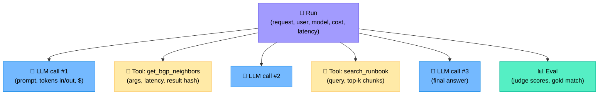
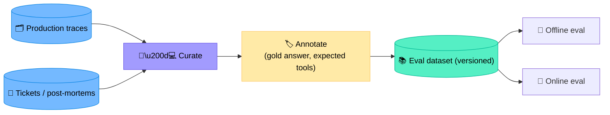
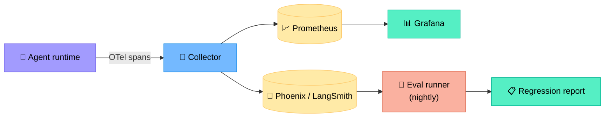
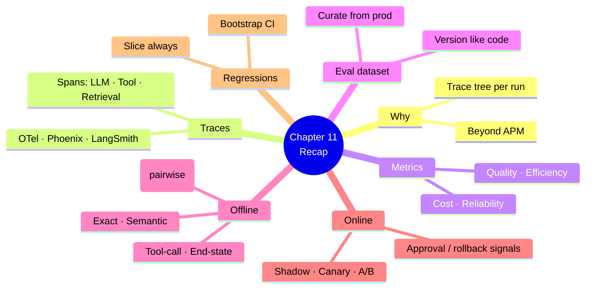

# Chapter 11 — Observability and Evaluation of Agents

> **Learning objectives:** Treat agents as production software: trace every run, define the right metrics (quality, latency, cost), build eval datasets from real incidents, run offline and online evaluation (shadow / A-B), and detect regressions.

---

## 11.1 Why agents need their own observability

Traditional APM (Prometheus, Grafana) tracks CPU/RPS/latency. Agents add new dimensions:

| Dimension | Why it's new |
|:--|:--|
| **Reasoning trace** | Multi-step think → act → observe |
| **Tool calls** | Each is a side effect with its own latency/cost |
| **Token usage** | Direct cost driver |
| **LLM-as-judge scores** | Quality signal beyond pass/fail |
| **Hallucination & faithfulness** | Unique to LLM systems |

You need a **trace tree per run** plus aggregate metrics.

---

## 11.2 The trace tree



### What to capture per span

| Field | Why |
|:--|:--|
| `span_id`, `parent_id`, `trace_id` | Tree reconstruction |
| `name`, `kind` (llm / tool / retrieval / agent) | Filtering |
| `inputs`, `outputs` (with redaction) | Replay + debugging |
| `tokens_in`, `tokens_out`, `cost_usd` | Cost analytics |
| `latency_ms` | SLO tracking |
| `error` | Failure analysis |
| `tags`: model, prompt_version, agent_version, env | Slicing for regressions |

### Tooling

| Tool | Notes |
|:--|:--|
| **LangSmith** | Native for LangChain/LangGraph; great UI |
| **Arize Phoenix** | Open-source; OpenInference spans |
| **OpenTelemetry GenAI semantic conventions** | Vendor-neutral; integrate with existing OTel stack |
| **Weights & Biases Weave** | Strong eval/notebook integration |
| **Helicone, Langfuse** | Lightweight, hosted |

> **Recommendation:** start with **OTel + Phoenix** if you already have an observability stack; **LangSmith** if you live in the LangChain ecosystem.

---

## 11.3 The metrics that matter

Group metrics into four families.

### Quality

| Metric | Definition |
|:--|:--|
| **Task success rate** | % of runs achieving the goal (judged by gold answer or human) |
| **Tool-call accuracy** | Right tool, right args, right time |
| **Faithfulness** | Answer grounded in retrieved/tool evidence (LLM-judge) |
| **Hallucination rate** | Claims unsupported by evidence |
| **Citation correctness** | Cited sources actually support the claim |

### Efficiency

| Metric | Definition |
|:--|:--|
| **End-to-end latency (p50, p95)** | Time from request to final answer |
| **# LLM calls per run** | Indirect quality + cost driver |
| **# tool calls per run** | Should match charter expectation |
| **Tokens per run (in/out)** | Cost driver |

### Cost

| Metric | Definition |
|:--|:--|
| **$ per run (p50, p95)** | Direct cost |
| **$ per resolved incident** | Business KPI |
| **$ wasted on retries / timeouts** | Improvement target |

### Reliability

| Metric | Definition |
|:--|:--|
| **Error rate** (tool, model, parsing) | Stability |
| **Escalation rate** | Should trend *down* over time as agent matures |
| **Rollback rate** | Should trend *down*; spikes = regression |

---

## 11.4 Building the eval dataset

Your most valuable asset is a **golden set of real-world cases**.



### Good cases to include

| Bucket | Why |
|:--|:--|
| Recent real incidents | Reality > synthetic |
| Edge cases & failure modes | Force regression coverage |
| Easy wins | Sanity / smoke tests |
| Ambiguous / unsolvable | Verify "I don't know" behaviour |
| Adversarial prompts | Guardrail tests (Ch 12) |

### Versioning

Treat the dataset like code: Git-tracked, semantically versioned, with a changelog. A score is only comparable on the same dataset version.

---

## 11.5 Offline evaluation

Run the agent against the dataset, score automatically, then human-spot-check.

### Scoring methods

| Method | Best for | Caveats |
|:--|:--|:--|
| **Exact match** | Structured outputs (JSON fields) | Brittle for free text |
| **String/F1** | Short answers | Misses paraphrase |
| **Semantic similarity** (cosine) | Free text answers | Approximate |
| **LLM-as-judge** | Quality, faithfulness, helpfulness | Bias to verbose; use rubric + pairwise |
| **Tool-call check** | Did the agent call the right tools? | Requires expected-tools annotation |
| **End-state check** | Did the system reach the expected state? | For action-taking agents |

### Pairwise LLM-judge (less biased than absolute scoring)

> "Given the question, here are two candidate answers (A, B). Which is better? Why?"

Aggregate over many pairs for a strong signal.

---

## 11.6 Online evaluation

Offline isn't enough — distribution shifts in production.

```mermaid
flowchart LR
    REQ["📨 Live request"] --> RT{"Routing"}
    RT -->|100 %| AC["🤖 Active version"]
    RT -.->|0 % (shadow)| SH["🤖 Candidate version"]
    SH --> CMP["⚖️ Compare<br/>(no user impact)"]
    AC --> R["💬 Reply"]

    style REQ fill:#74b9ff,stroke:#0984e3,color:#000
    style AC fill:#a29bfe,stroke:#6c5ce7,color:#000
    style SH fill:#ffeaa7,stroke:#fdcb6e,color:#000
    style CMP fill:#55efc4,stroke:#00b894,color:#000
    style R fill:#55efc4,stroke:#00b894,color:#000
```

| Mode | What | When |
|:--|:--|:--|
| **Shadow** | Run candidate in parallel, don't return its answer | Pre-launch confidence |
| **Canary** | Route X % of traffic to candidate | Initial rollout |
| **A/B** | 50/50 split, measure outcomes | Statistical comparison |
| **Interleaving** | Both answers shown, user picks | UX-driven choice |

### Online signals

- Approval rate (Ch 9) — humans saying "yes" to proposals
- Rollback rate
- User feedback (👍/👎, explicit comments)
- Downstream incident MTTR change

---

## 11.7 Detecting regressions

A regression is a statistically significant drop in a metric. Detection ingredients:

| Ingredient | Detail |
|:--|:--|
| **Baseline** | Last released version on same dataset |
| **Statistical test** | Bootstrap CI or paired t-test on per-case scores |
| **Slicing** | Per-tool, per-question-type, per-tenant — global avg can hide local breakage |
| **Alert** | CI failure on PR or production alert post-deploy |

> A common mistake: a +1 % average score hides a -20 % on a critical slice (e.g. BGP). **Always slice.**

---

## 11.8 Putting it together — a minimal stack



| Layer | Purpose |
|:--|:--|
| OTel spans | Capture every LLM/tool/agent step |
| Phoenix/LangSmith | Trace inspection, dataset, evals |
| Prometheus + Grafana | Aggregate metrics + alerts |
| Eval runner (CI) | Nightly + PR runs against golden set |

---

## 11.9 Pitfalls

| Pitfall | Fix |
|:--|:--|
| Tracking only token cost, not quality | Add quality KPIs and judge scores |
| Eval dataset never updates | Mine new cases from prod weekly |
| LLM-judge with same model as agent | Bias — use a different model |
| Average-only metrics | Slice by tool, tenant, question type |
| No PII redaction in traces | Redact at the collector |
| Letting the judge see the gold answer in prompt design | Leakage — judges should not |

---

## Summary



---

## Exercises

1. **Span fields.** List 6 fields you'd attach to a `tool.call` span; mark which need redaction.
2. **Metric design.** Define a "tool-call accuracy" metric formally and propose how to annotate gold expectations.
3. **Dataset.** Pick 5 categories of real incidents you would mine to build a 100-case golden set.
4. **Judge prompt.** Write a pairwise LLM-judge rubric for "diagnostic helpfulness".
5. **Slicing.** Average score is +0.5 % but BGP slice is -15 %. What do you do?
6. **Online plan.** Design a 4-week rollout: shadow → canary → A/B → full, including kill criteria at each step.
