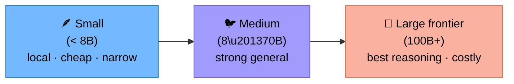
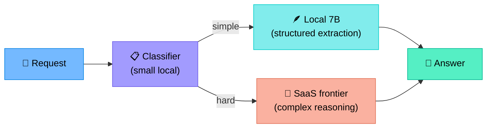
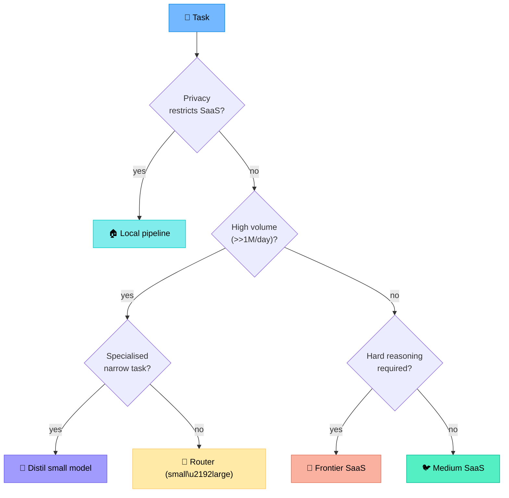
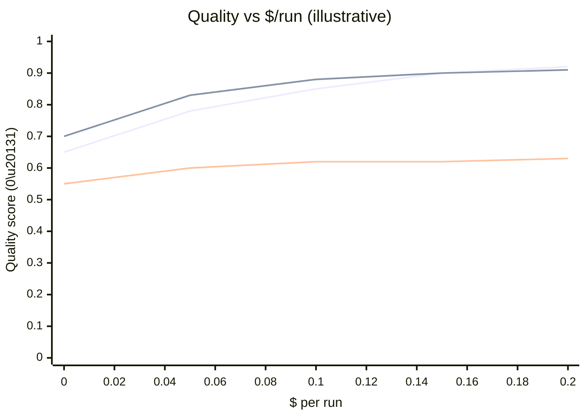
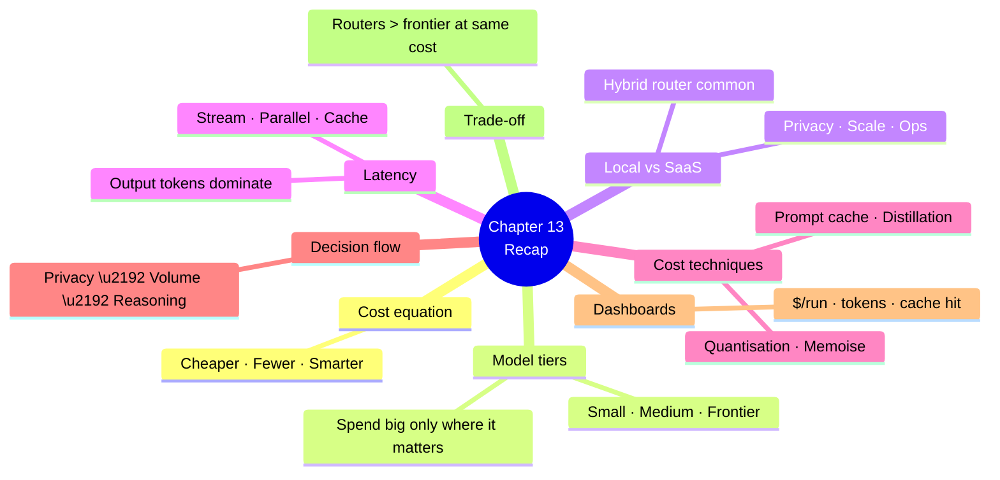

# Chapter 13 — Cost, Performance and Model Selection

> **Learning objectives:** Understand the economics of LLM-powered agents, choose between small and frontier models, weigh local vs. SaaS deployment, design for latency budgets, and apply concrete techniques (caching, routing, distillation) to cut cost without losing quality.

---

## 13.1 The cost equation

For a single agent run:

$$
\text{Cost} = \sum_{i=1}^{N_{\text{LLM}}} \big( p_{\text{in}}^{(i)} \cdot T_{\text{in}}^{(i)} + p_{\text{out}}^{(i)} \cdot T_{\text{out}}^{(i)} \big) \;+\; \sum_{j=1}^{N_{\text{tool}}} C_{\text{tool}}^{(j)}
$$

| Variable | Meaning |
|:--|:--|
| $N_{\text{LLM}}$ | Number of LLM calls in the run |
| $p_{\text{in}}, p_{\text{out}}$ | Per-token prices (input/output) |
| $T_{\text{in}}, T_{\text{out}}$ | Tokens (input/output) per call |
| $C_{\text{tool}}^{(j)}$ | External cost of tool $j$ (search API, ThousandEyes, etc.) |

Three levers to pull:

1. **Cheaper tokens** (smaller model, prompt caching, local)
2. **Fewer tokens** (concise prompts, summarised tool outputs, shorter chains)
3. **Fewer calls** (better tools, early stopping, parallelism)

---

## 13.2 The model landscape

| Tier | Examples (2026 era) | Sweet spot |
|:--|:--|:--|
| Small | Llama 3.2 3B, Phi-4, Qwen 2.5 7B | Routing, classification, structured extraction |
| Medium | Llama 3.3 70B, Mistral Large, Qwen 2.5 72B | Most tool-calling agents |
| Large / frontier | GPT-4.1, Claude Opus 4, Gemini Ultra | Hard reasoning, judge, complex multi-step |

> Names and tiers move quickly — what matters is the **principle**: don't pay frontier prices for a task a 7B model can handle.

### Where to spend the big model

| Phase | Suggested tier |
|:--|:--|
| Intent classification / routing (supervisor) | Small |
| Tool selection in a 5–10 tool agent | Small/Medium |
| Diagnosis with reasoning over evidence | Medium → Large |
| Final synthesis & user-facing answer | Medium |
| LLM-as-judge in eval | Different model than the agent, often Large |

---

## 13.3 Local vs. SaaS

### Decision factors

| Factor | Lean SaaS | Lean Local |
|:--|:--|:--|
| Data sensitivity | Low (public) | High (configs, customer IPs) |
| Latency requirement | Forgiving | Sub-200 ms / on-device |
| Cost at scale (very high QPS) | Low/medium QPS | High sustained QPS |
| Ops capacity | Small team | DevOps capacity to run GPUs |
| Need bleeding-edge model | Yes | No |
| Air-gapped / regulated | No | Yes |

### Local runtimes

| Runtime | Notes |
|:--|:--|
| **Ollama** | Easy local serving, good for dev |
| **vLLM** | High-throughput inference (PagedAttention), production |
| **TGI** (HF Text Generation Inference) | Production, good ecosystem |
| **llama.cpp** | CPU/edge inference; quantised models |
| **NVIDIA NIM** | Packaged enterprise inference microservices |

### Hybrid is normal

This **router pattern** typically captures 60–80 % of requests on the cheap path while preserving frontier quality where it matters.

---

## 13.4 Latency budgets

Decompose end-to-end latency:

| Component | Typical |
|:--|:--|
| Network round-trip to LLM | 50–250 ms |
| Prompt processing (input tokens) | linear in $T_{\text{in}}$ |
| Generation (output tokens) | linear in $T_{\text{out}}$ (often the dominant term) |
| Tool call (device, API) | 100 ms – 5 s |
| Re-rank / retrieval | 50–500 ms |

> Generation latency scales with **output** tokens. Asking for shorter answers is the cheapest win.

### Patterns to cut latency

| Pattern | Effect |
|:--|:--|
| **Streaming** | First token in < 500 ms; UX feels fast |
| **Parallel tool calls** | When tools are independent |
| **Speculative decoding** | Draft + verify model |
| **Early stopping** | Stop as soon as enough evidence (Ch 7 budgets) |
| **Caching** (prompt, embedding, retrieval, tool) | Skip work entirely |

---

## 13.5 Cost-reduction techniques (practical)

### Prompt caching

Most providers (OpenAI, Anthropic) cache repeated prefixes — system prompt + tool definitions can be reused for ~10× cheaper. Keep the **stable** part of the prompt at the top.

### Smaller models for "boring" calls

Use a small model for:

- Routing / classification
- Summarising tool outputs (§4.7)
- Extracting fields from text
- LLM-as-judge for cheap structural checks

### Distillation

Run frontier model offline to label data, fine-tune a small model on those labels. Common for high-volume, narrow tasks (e.g. log-line classification).

### Quantisation (local)

INT8 / INT4 (e.g. AWQ, GPTQ) cut GPU memory by 2–4× with marginal quality loss for many tasks.

### Truncation and summarisation of context

Don't ship 200 log lines — ship a 10-line summary. Don't ship full traces — ship the last N spans.

### Batch and cache embeddings

Embedding the same query twice is waste. Cache by `sha256(text + model + version)`.

### Tool result memoisation

Within a run (or short TTL), cache `(tool, args)` → result. Re-asking "is the link up?" five times is common.

---

## 13.6 A decision flow for model choice

---

## 13.7 Cost dashboards and budgets

Track in production:

| Metric | Alert when |
|:--|:--|
| $ per run (p50, p95) | p95 > 2× baseline |
| Daily spend per agent | > budget for the day |
| Tokens per run | > 2× baseline (prompt bloat?) |
| Tool-call count per run | spikes (loop?) |
| Cache hit rate (prompt, retrieval, tool) | drops sharply |
| Model mix (% frontier vs. small) | unexpected shift |

> Cost is a **quality signal**: a sudden spike usually means a bug (loop, runaway, regression in routing).

---

## 13.8 Quality / cost trade-off

Two important shapes:

- **Diminishing returns**: doubling spend rarely doubles quality.
- **Routers** often dominate frontier-only at the same cost.

---

## 13.9 Anti-patterns

| Anti-pattern | Symptom |
|:--|:--|
| "Use the biggest model everywhere" | Cost explodes; quality plateaus |
| Long system prompts re-sent every call | Tokens wasted; fix with prompt cache |
| Dumping raw `show` output to the LLM | Token bloat; summarise first |
| Ignoring streaming | UX feels broken even on fast backends |
| No cost dashboard | Bills surprise you |
| Hard-coding model names everywhere | Painful to swap; use a config layer |

---

## Summary

---

## Exercises

1. **Cost calc.** A run uses 8k input + 1k output tokens at $3/M in + $15/M out, plus 3 tool calls at $0.002 each. Total cost?
2. **Routing design.** Sketch a router for a NetOps agent that splits "lookup" (small), "triage" (medium), "RCA" (frontier).
3. **Latency budget.** 5-second p95 budget — allocate it across LLM, retrieval, tools, network. Justify.
4. **Cache plan.** What would you cache and at what TTL: tool calls, embeddings, prompt prefixes, retrieved chunks?
5. **Distillation.** Identify a NetOps task narrow and high-volume enough to justify distilling a small model. Outline the data labelling step.
6. **Anti-pattern hunt.** Read a teammate's prompt that resends a 4k-token system message every call. Propose two fixes.
