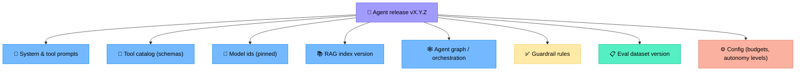
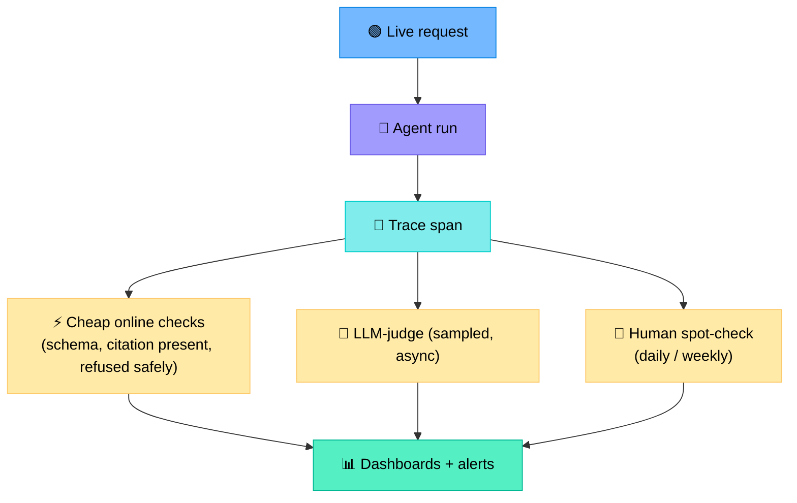
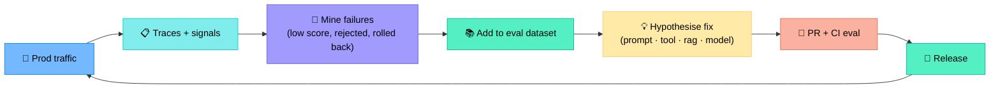
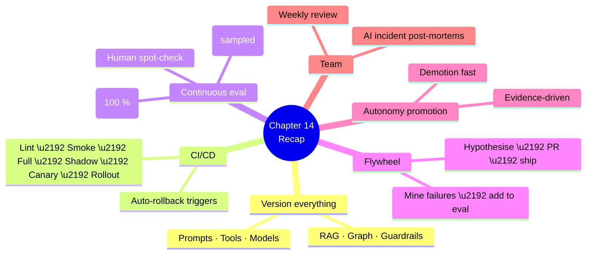

# Chapter 14 — AgentOps: CI/CD and Lifecycle for Agents

> **Learning objectives:** Treat agents as living systems with their own SDLC: version prompts/tools/models, build CI/CD pipelines (regression tests + canary), run continuous evaluation, and feed production signals back into improvement.

---

## 14.1 What is AgentOps?

AgentOps = **DevOps for agentic systems**. It extends MLOps with the specifics of LLM-powered agents:

| MLOps | AgentOps |
|:--|:--|
| Versions models + datasets | + prompts, tools, RAG indices, agent graphs |
| Trains + deploys models | + prompt rollouts, A/B, canary by traffic % |
| Monitors data drift | + tool-call drift, prompt-injection rate |
| Re-trains on schedule | + re-tunes prompts; refreshes RAG; updates eval set |

---

## 14.2 What needs to be versioned



A reproducible release = **all of these pinned together**, in one Git commit (or one manifest).

### Example release manifest

```yaml
agent: nettriage
version: 1.5.0
model:
  planner: anthropic/claude-opus-4.7-2026-05
  worker:  openai/gpt-4.1-mini-2026-03
prompts:
  system: prompts/nettriage_system_v12.md
  worker: prompts/diagnoser_v7.md
tools: tools/catalog.v9.yaml
rag:
  collection: runbooks
  index_version: 2026-05-14T12:00Z
graph: graphs/nettriage_v3.py
guardrails: rails/v4.colang
config:
  budgets: {calls: 12, tokens: 30000, wall_s: 60}
  autonomy: L2
eval_dataset: evals/nettriage.v2026-05.jsonl
```

---

## 14.3 The CI/CD pipeline


### Gate criteria per stage

| Stage | Pass criteria |
|:--|:--|
| Lint | Prompts compile, tool schemas valid |
| Unit | Each tool wrapper passes its tests |
| Smoke (10–30 cases) | ≥ baseline – ε on critical slices |
| Full eval | No slice regressed > 5 %; cost p95 not worse > 10 % |
| Shadow | Disagreement with prod < threshold; no safety violation |
| Canary | Online metrics (approval, rollback) ≥ baseline |
| Rollout | Sustained for 24 h before next ramp |

### Auto-rollback triggers

| Trigger | Action |
|:--|:--|
| Error rate > 2× baseline | Rollback |
| Rollback-by-operator rate > 2× | Rollback |
| Cost p95 > 3× baseline | Rollback |
| Safety violation detected | Immediate rollback + page |
| Latency p95 > SLO | Rollback if sustained > 10 min |

---

## 14.4 Prompt and tool versioning

### Prompts

- One file per prompt; include `prompt_id` + `version` in metadata.
- Embed `prompt_version` in every LLM call → traceable in logs.
- Diff-review prompts like code; require approval.
- Keep an archive of all deployed versions for replay.

### Tools

| Change | Rule |
|:--|:--|
| New tool | Minor bump; full eval |
| New required arg | **Major** bump; backward-incompatible |
| Description change | Minor — but eval (LLM tool selection is sensitive to descriptions) |
| Bugfix in implementation | Patch; eval still recommended |

> Tool descriptions are part of the **prompt** for the LLM. Treat them as such.

---

## 14.5 Continuous evaluation

Three layers in production.



| Layer | Latency | Coverage | Cost |
|:--|:--|:--|:--|
| Online checks | < 100 ms | 100 % | ~0 |
| LLM-judge sampled | seconds (async) | 5–20 % | $$ |
| Human spot-check | hours/days | 1–2 % | $$$ |

Combine all three: cheap broad coverage + deep but narrow human eyes.

---

## 14.6 The improvement flywheel



A healthy team ships **small, reviewed changes weekly**, not big rewrites yearly.

### Sources of fix hypotheses

| Signal | Common fix |
|:--|:--|
| Wrong tool chosen | Better tool description; reduce tool count |
| Hallucinated answer | Stricter prompt; add `say "I don't know"` rule |
| Stale RAG hit | Refresh index; add date filter |
| Long traces (>10 tool calls) | Lower budget; pre-summarise outputs |
| High rollback rate on a class | Tighten preconditions; add HITL gate |

---

## 14.7 Promoting autonomy safely

Autonomy (Ch 9) should be promoted **per action**, evidence-driven.

| Stage | Required evidence |
|:--|:--|
| L2 → L3 (timed veto) | 200+ runs at L2 with ≥ 95 % approval; rollback < 1 % |
| L3 → L4 (autonomous) | 1000+ runs at L3 with no safety incident; verify step in place |
| Any promotion | Documented post-mortem of *all* failures in the window |

Demotions must be just as easy: a single safety incident → demote.

---

## 14.8 Team practices

| Practice | Why |
|:--|:--|
| **Weekly eval review** | Look at regressions and qualitative samples together |
| **"Bad trace of the week"** | Pick one ugly trace, agree on a fix |
| **Prompt PR template** | Force "what changed / why / eval delta" |
| **Shared eval set** | Single source of truth across teams |
| **On-call rotation for the agent** | Like any production service |
| **Post-mortems for AI incidents** | Same rigour as for outages |

---

## 14.9 Anti-patterns

| Anti-pattern | Fix |
|:--|:--|
| Tweak prompt in production directly | Force everything through CI |
| Eval only on success rate | Add cost, latency, safety, slices |
| One person "owns the prompt" | Treat prompts as shared code |
| Big-bang release ("now with GPT-5!") | Shadow + canary, even for "obvious wins" |
| No replay capability | Build trace replay from day one |
| Manual rollbacks only | Automate trigger + rollback |

---

## Summary



---

## Exercises

1. **Manifest.** Write a release manifest (per §14.2) for an imaginary "config-drift agent" you maintain.
2. **CI gates.** Define 5 quantitative pass/fail gates for your full eval stage.
3. **Tool versioning.** Renaming `query_logs` → `search_logs` and adding required arg `since`. What kind of version bump? What do you migrate?
4. **Rollback rule.** Design an auto-rollback rule combining error rate, rollback rate, and safety violations.
5. **Flywheel.** Choose one failure mode from production traces and walk through the §14.6 flywheel for it.
6. **Promotion.** Your `clear_arp` tool has run 300 times at L2 with 97 % approval, 0 rollbacks. Promote to L3? What additional checks would you add before doing so?
