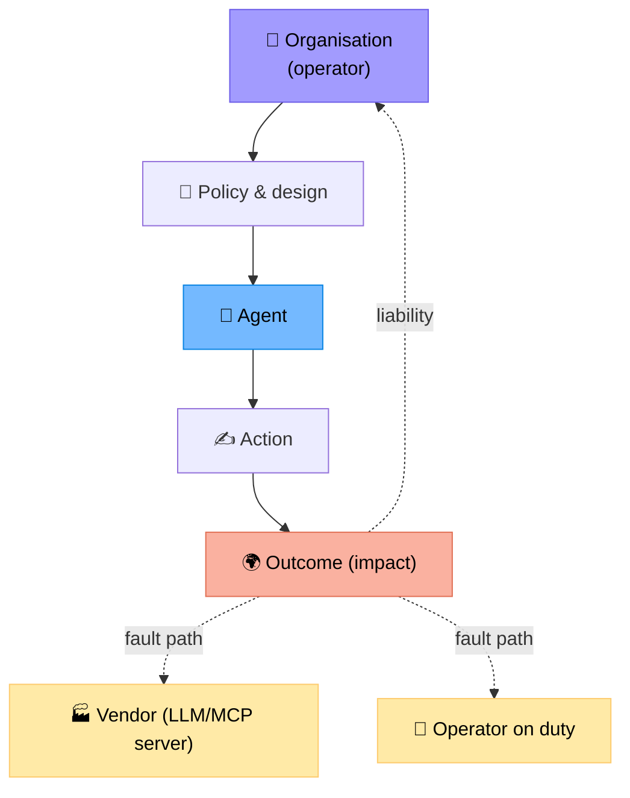
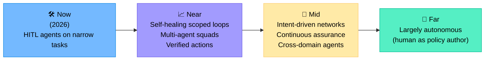
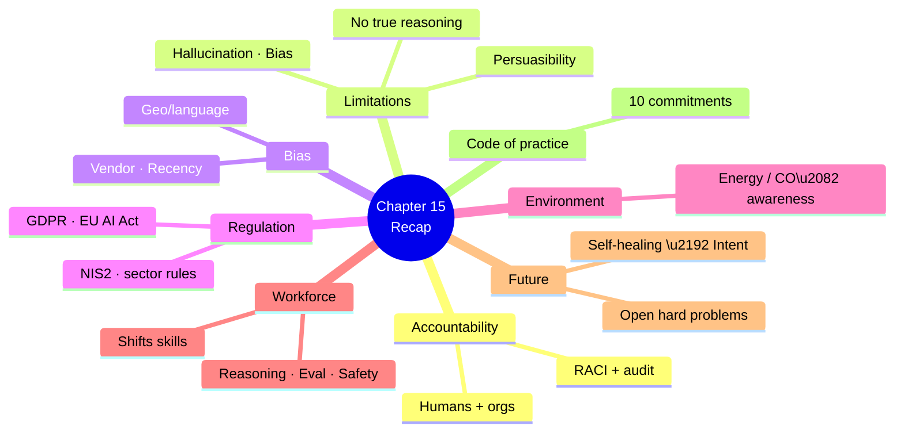

# Chapter 15 — Ethics, Limitations and the Future

> **Learning objectives:** Reason about responsibility and accountability when agents operate networks, recognise bias and limitations inherent to LLM-based systems, anticipate workforce impact on network engineers, and look ahead to autonomous networking.

---

## 15.1 Why ethics is not optional

Networks carry hospitals, emergency calls, schools, financial systems. An incorrect agent decision can have real-world consequences. With great automation comes:

| Stakeholder | Concern |
|:--|:--|
| **Customers** | Service reliability, privacy, fairness |
| **Operators** | Job security, skill evolution, work conditions |
| **Society** | Critical-infrastructure resilience |
| **Regulators** | Compliance (GDPR, NIS2, telecom rules) |
| **Vendors / providers** | Liability, transparency |

---

## 15.2 Accountability — who is responsible when the agent is wrong?

The honest answer: **humans and organisations remain responsible**. "The AI did it" is not a defence — legally, ethically, or operationally.

### A practical accountability matrix

| Decision | Who is accountable |
|:--|:--|
| What the agent is allowed to do (charter, autonomy level) | Engineering manager + SecOps |
| Code & prompts deployed | Reviewer + release engineer |
| Approval of a specific change | The approver on duty (Ch 9) |
| Model behaviour | Provider (limited) + integrator |
| Outcome (downtime, breach) | Organisation as a whole |

> A clear **RACI** + audit log (Ch 12) makes after-the-fact analysis possible.

---

## 15.3 Limitations of today's LLM agents

| Limitation | Implication |
|:--|:--|
| **Hallucination** | Plausible but wrong answers |
| **No real understanding** | Pattern-matching, not reasoning |
| **Inconsistency** | Same input ≠ same output (without seeding) |
| **Limited working memory** | Long sessions lose context |
| **Knowledge cutoff** | Recent CVEs, RFCs, vendor changes unknown |
| **Bias in training data** | Vendor- or product-skewed answers |
| **Persuasibility** | Prompt injection (Ch 12) |
| **Cost & latency** | Slower & pricier than scripts for routine tasks |

Pretending these don't exist is the surest way to deploy badly. Designs in Chapters 5–14 are precisely the mitigations.

---

## 15.4 Bias and fairness in NetOps

Bias is less obvious than in HR or lending but it exists:

| Bias | Example |
|:--|:--|
| **Vendor bias** | Training data dominated by Cisco docs → poor Juniper diagnoses |
| **Recency bias** | Newer protocols better represented than legacy |
| **Geographic / language bias** | English runbooks favoured; non-English deployments under-served |
| **Confidence bias** | Models tend to *sound* confident even when wrong |
| **Operator bias** | Solutions favoured by past tickets perpetuated even when suboptimal |

Mitigations: balanced RAG corpora, multi-vendor evals, calibration (Ch 11), pairwise judging across vendors.

---

## 15.5 Privacy and regulation

Key frameworks relevant to network operators (non-exhaustive, EU-flavoured):

| Framework | Relevance |
|:--|:--|
| **GDPR** | Customer IPs, MAC addresses can be personal data; logs subject to retention limits |
| **EU AI Act** (2024–2026) | Risk-based obligations; "high-risk" systems require risk management, logging, transparency |
| **NIS2** | Cybersecurity duties for essential service providers including telecoms |
| **Sector rules** | Telecom regulators (ARCEP, BNetzA, FCC…), healthcare (HIPAA), finance (DORA) |

> A NetOps agent operating critical infrastructure may well qualify as **high-risk** under the EU AI Act — implying documentation, monitoring, human oversight obligations.

---

## 15.6 Environmental footprint

| Factor | Note |
|:--|:--|
| Training large models | Significant one-off energy/water cost (mostly outside the operator's control) |
| Inference at scale | Adds up; routers (Ch 13) help |
| Local quantised models | Lower per-token energy, sometimes worse efficiency at low load |
| Caching | Reduces both cost and footprint |

Reporting agent energy / CO₂ alongside cost is a healthy practice.

---

## 15.7 Workforce impact

LLM agents won't replace network engineers — but they **will change the job**.

| Shrinking | Growing |
|:--|:--|
| Manual CLI troubleshooting | Designing safe automation |
| Repetitive config changes | Writing runbooks, evals, guardrails |
| Tier-1 ticket triage | Supervising agent fleets |
| Memorising vendor syntax | Reasoning about distributed systems and data |

### New skills network engineers benefit from

- Python and async basics
- Telemetry & observability literacy
- Prompt and tool design
- Statistical thinking (eval, regressions)
- Security and privacy literacy
- Ethics and responsible AI

> This is why this course exists. Engineers who understand both networking **and** agents will run the networks of the next decade.

---

## 15.8 Looking ahead — what is realistically next?

### Hard problems still open

| Problem | Why it's hard |
|:--|:--|
| **Reliable reasoning over very large state** | Networks have millions of facts; context windows can't hold them |
| **Provable safety bounds** | Hard to prove an LLM won't ever do X |
| **Verified planning** | Combining symbolic verification (Batfish-style) with LLM planning |
| **Cross-vendor / cross-domain coordination** | Standards (MCP, A2A, OpenConfig) help but adoption is uneven |
| **Long-horizon learning** | Agents that improve from operational experience without retraining |
| **Trust & explainability** | Why did the agent do that? Today's explanations are themselves LLM-generated |

### Industry directions worth tracking

- **Network digital twins + agents** (Batfish, Forward, vendor twins)
- **Telco/cloud autonomous network programmes** (TM Forum AN levels, ETSI ZSM)
- **MCP and A2A standardisation**
- **Open-weights specialised network models**
- **Continuous assurance platforms** (intent → measure → remediate)

---

## 15.9 A code of practice (suggested)

Whatever you build, commit to:

1. **Charter every agent** — scope and limits in writing.
2. **Default to least privilege** — even at the cost of speed.
3. **Always provide a kill switch** — and test it.
4. **Be honest about uncertainty** — calibrate confidence, allow "I don't know".
5. **Cite evidence** — operators must be able to verify.
6. **Keep humans in the loop where it matters** — promote autonomy only on evidence.
7. **Audit everything** — immutable logs, replayable runs.
8. **Measure quality, cost, safety** — not just availability.
9. **Respect privacy** — by-design, not bolted on.
10. **Train your team** — both networking *and* agent skills.

> These ten lines are simple, but together they outperform the most sophisticated prompt engineering.

---

## Summary

---

## Exercises

1. **Accountability map.** Build a RACI for "agent automatically applies an ACL change at 3am that breaks a customer".
2. **Bias audit.** Design a simple test that detects vendor bias in your agent's RCA quality.
3. **EU AI Act.** Argue whether a closed-loop BGP-remediation agent is "high-risk". What documentation would be required?
4. **Workforce plan.** As a team manager, propose a 6-month upskilling plan for tier-1 NOC engineers transitioning to "agent supervisors".
5. **Future-ready design.** Pick one open hard problem in §15.8 and propose how today's design choices (Ch 5–14) prepare for it.
6. **Code of practice.** Pick three commitments from §15.9 and write the concrete engineering controls that enforce each.
