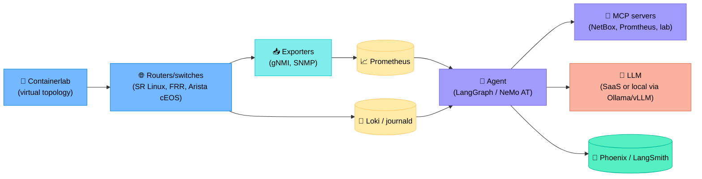
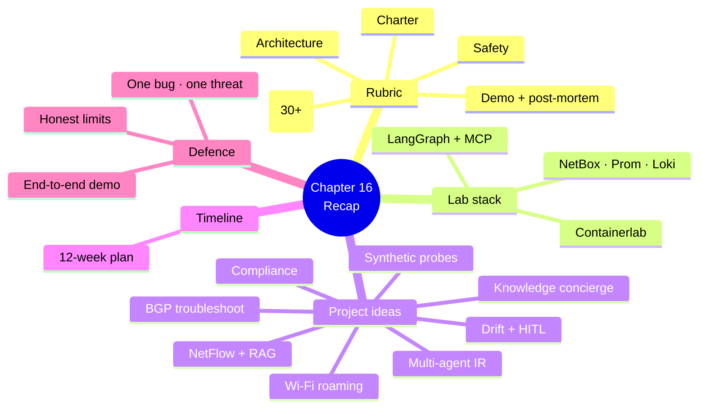

# Chapter 16 — Capstone Project Ideas

> **Learning objectives:** Apply the full course in a realistic, end-to-end project. Each project below specifies scope, lab setup, toolset, evaluation plan, and a stretch goal. Pick one (or invent your own using the same template).

---

## 16.1 Project rubric (applies to all)

Every capstone delivery should include:

| Deliverable | Detail |
|:--|:--|
| **Charter** (1 page) | Goal, scope, in/out, autonomy, success criteria — Ch 7 |
| **Architecture diagram** | Components, data flow, tool boundaries |
| **Code repo** | Reproducible, README, `make run` |
| **Toolset spec** | Each tool: schema, family, safety properties — Ch 5 |
| **RAG / data inventory** | Sources, refresh cadence — Ch 4 / Ch 6 |
| **Eval dataset (≥ 30 cases)** | Curated + annotated — Ch 11 |
| **Eval report** | Quality / cost / latency / safety on baseline + your agent |
| **Safety review** | Threat model + guardrails — Ch 12 |
| **Demo video (5 min)** | Live run + explanation |
| **Post-mortem of one bug** | What broke, why, fix — Ch 14 |

### Suggested grading weights

| Criterion | Weight |
|:--|:--|
| Correctness on eval set | 25 % |
| Safety / guardrail design | 20 % |
| Engineering quality (code, repo, traces) | 20 % |
| Evaluation rigour | 15 % |
| Presentation & demo | 10 % |
| Originality / stretch | 10 % |

---

## 16.2 Recommended lab stack

You can complete every project below on a laptop (≥ 16 GB RAM) or a small cloud VM.

Free / open-source choices (see Appendix B):

| Component | Pick |
|:--|:--|
| Topology | Containerlab + SR Linux / FRR / cEOS |
| Inventory | NetBox (Docker) |
| Metrics | Prometheus + Grafana |
| Logs | Loki + Promtail |
| Tracing | Phoenix (Arize) — open source |
| Vector store | Chroma or Qdrant |
| Agent framework | LangGraph, CrewAI, NeMo Agent Toolkit, or Pydantic AI |
| Local LLM | Ollama (Llama 3.1 8B / Qwen 2.5 7B) |

---

## 16.3 Project A — BGP Troubleshooting Agent with MCP

**Goal:** Diagnose BGP issues (session down, route missing, route flap, MED/LP misconfig) on a 6-router lab.

| Aspect | Detail |
|:--|:--|
| **Topology** | 2 ASes, 6 routers, eBGP + iBGP, route reflectors |
| **Faults to inject** | (a) neighbor down, (b) AS path filter, (c) prefix-list, (d) route flap |
| **Tools (via MCP)** | `get_bgp_neighbors`, `get_route`, `get_recent_changes`, `path_analysis`, `search_runbook` |
| **Autonomy** | Read-only (no writes) |
| **Eval (30 cases)** | 8 per fault class + 6 false alarms |
| **Stretch** | Add `bgp_soft_clear` action behind HITL with verify (Ch 10) |

---

## 16.4 Project B — NetFlow Anomaly Investigator (RAG)

**Goal:** Given a NetFlow anomaly alert, produce a top-talkers report, classify likely cause (DDoS, backup window, misconfig), and cite runbooks.

| Aspect | Detail |
|:--|:--|
| **Data** | nfdump / GoFlow + Prometheus aggregates |
| **RAG corpus** | 50+ pages of internal runbooks (DDoS, backup procedures, IP allocations) |
| **Tools** | `query_topk_flows`, `query_prefix_owner` (NetBox), `search_runbook`, `lookup_threat_intel` |
| **Autonomy** | Read-only |
| **Eval** | 25 anomaly snapshots labelled with cause |
| **Stretch** | Hybrid retrieval (BM25 + vectors + RRF) and an ablation showing the improvement (Ch 6) |

---

## 16.5 Project C — Multi-Agent Incident Response Simulator

**Goal:** Reproduce the squad from Ch 8 (Observer → Diagnoser → Planner → HITL → Executor → Reviewer) on a lab.

| Aspect | Detail |
|:--|:--|
| **Topology** | Mixed faults: BGP, OSPF, ACL, interface |
| **Agents** | 5 specialised + 1 supervisor (LangGraph) |
| **Protocol** | A2A-style messages with trace IDs |
| **Tools** | Read + diagnostic + scoped write (dry-run default) |
| **HITL** | Slack approvals (use a simple webhook bot) |
| **Eval** | 20 scripted incidents, measure MTTR and approval-correct rate |
| **Stretch** | Add a debate pattern between Diagnoser + Planner for ambiguous cases |

---

## 16.6 Project D — Config Drift Agent with HITL

**Goal:** Detect drift between intended config (NetBox / Git) and running config; propose a remediation diff; require approval before applying.

| Aspect | Detail |
|:--|:--|
| **Sources** | NetBox source-of-truth + Git templates + device running config |
| **Tools** | `fetch_intended`, `fetch_running`, `compute_diff`, `propose_remediation`, `push_with_commit_confirm` (HITL) |
| **Autonomy** | L2 (approve & run) |
| **Eval** | 15 drift scenarios (intentional + accidental); measure precision/recall of "true drift" and human-time-to-approve |
| **Stretch** | Auto-classify drift as "safe-to-revert" vs. "needs human design"; only the former goes to L3 |

---

## 16.7 Project E — Wi-Fi Roaming RCA Assistant

**Goal:** Given user complaints "Wi-Fi drops when I move from meeting room A to B", correlate AP logs, RSSI metrics, and roaming events to propose a likely cause.

| Aspect | Detail |
|:--|:--|
| **Data** | Simulated AP logs + RSSI traces (you can mock with scripts) |
| **Tools** | `query_ap_events`, `query_client_rssi`, `lookup_runbook`, `lookup_known_chipset_issues` |
| **Autonomy** | Read-only; recommends operator actions |
| **Eval** | 20 client traces with labelled root causes |
| **Stretch** | Cross-AP signal correlation (graph DB query) |

---

## 16.8 Project F — Compliance Auditor

**Goal:** Continuously audit a fleet against a security baseline (no telnet, SSH v2 only, NTP set, AAA configured, banner present).

| Aspect | Detail |
|:--|:--|
| **Inputs** | Device configs (read-only) |
| **Tools** | `fetch_config`, `check_rule(rule_id, config)`, `open_ticket` |
| **Autonomy** | L1 (drafts tickets, human files) |
| **Eval** | 30 device configs with seeded violations |
| **Stretch** | Generate a per-team weekly compliance report (Markdown) with citations to the violating lines |

---

## 16.9 Project G — Synthetic Probe Orchestrator

**Goal:** An agent that, given an SLO ("Site A → Site B p95 < 50 ms"), schedules synthetic probes, watches results, and raises an investigation agent if SLO is at risk.

| Aspect | Detail |
|:--|:--|
| **Probes** | `ping`, `traceroute`, simple TCP connect (Docker-based) |
| **Tools** | `schedule_probe`, `cancel_probe`, `query_results`, `escalate_to_diagnoser` |
| **Autonomy** | L3 for probe scheduling; L2 for escalation |
| **Eval** | Lab with injected latency / loss; measure detection time vs. baseline |
| **Stretch** | Plug into Project C as a "watchdog" agent |

---

## 16.10 Project H — Knowledge Concierge for NOC

**Goal:** A chat interface NOC engineers query in natural language: *"How do we handle a TACACS server failure?"*, *"What's the runbook for elephant flows on core-1?"*

| Aspect | Detail |
|:--|:--|
| **Corpora** | Runbooks, post-mortems, design docs, vendor advisories |
| **Tools** | `search_corpus(corpus_name, query)`, `summarise_thread`, `cite_only` |
| **Autonomy** | Read-only Q&A |
| **Eval** | 40 historical questions from past tickets; measure citation correctness and answer faithfulness |
| **Stretch** | Add a "freshness" filter (no docs older than X months for security topics); compare with/without |

---

## 16.11 Pick-your-own — template

| Field | Fill in |
|:--|:--|
| Goal (one sentence) | |
| In / out of scope | |
| Endpoints / data sources | |
| Toolset (5–10) | |
| Autonomy level (L0–L4) | |
| Risks + mitigations | |
| Eval cases (≥ 30) | |
| Success criteria (quantitative) | |
| Stretch goal | |

If you can fill every row with a precise answer, you have a viable project.

---

## 16.12 Suggested timeline (12 weeks)

```mermaid
flowchart LR
    W1["Wk 1\nCharter\n+ lab up"] --> W2["Wk 2\nTools\n+ data"]
    W2 --> W3["Wk 3\nFirst agent\nE2E"]
    W3 --> W4["Wk 4\nRAG / multi-agent"]
    W4 --> W5["Wk 5\nGuardrails"]
    W5 --> W6["Wk 6\nEval set\n+ first scores"]
    W6 --> W7["Wk 7\nIterate (flywheel)"]
    W7 --> W8["Wk 8\nHITL / closed loop"]
    W8 --> W9["Wk 9\nObservability\n+ dashboards"]
    W9 --> W10["Wk 10\nShadow / canary"]
    W10 --> W11["Wk 11\nPolish\n+ demo prep"]
    W11 --> W12["Wk 12\nFinal report\n+ defence"]

    style W1 fill:#74b9ff,stroke:#0984e3,color:#000
    style W6 fill:#ffeaa7,stroke:#fdcb6e,color:#000
    style W10 fill:#fab1a0,stroke:#e17055,color:#000
    style W12 fill:#55efc4,stroke:#00b894,color:#000
```

---

## 16.13 What good looks like — a checklist before defence

- [ ] You can demo the agent end-to-end live
- [ ] Every tool call appears in a trace UI
- [ ] You can name every metric on your eval report
- [ ] You can show one bug + post-mortem
- [ ] You can describe one threat you defended against
- [ ] You can articulate why your autonomy level is what it is
- [ ] You can explain *why* your agent works on the cases where it works — and where it doesn't

---

## Summary

---

## Exercises

1. **Pick & charter.** Choose one project; write its one-page charter using §16.11's template.
2. **Tool list.** For your chosen project, design the 5–10 tools (schema + family + safety properties).
3. **Eval seeds.** Draft 5 representative eval cases for your project, each with the gold answer.
4. **Risk register.** List 5 risks and concrete mitigations (link back to Ch 9 / Ch 12).
5. **Demo storyboard.** Draft the 5-minute demo script: what you click, what you show, what you say.
6. **Future-proofing.** Identify one design choice that would let you swap LLMs or add an agent later with minimal rewrite.
