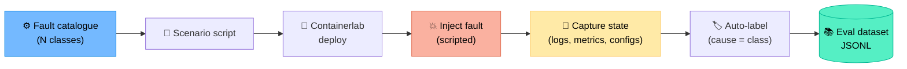

# Appendix F — Sample Datasets

> Where to get realistic, openly-licensed data for training, RAG corpora, and evaluation. Combined with the lab in Appendix B you can fully reproduce every capstone in Chapter 16.

---

## F.1 Synthetic vs. real

| Type | Pros | Cons |
|:--|:--|:--|
| **Synthetic** (you generate it) | Reproducible, labelled, no privacy issues | May not capture real-world noise |
| **Public datasets** | Realistic distributions | Often coarse-grained, hard to label |
| **Internal (anonymised)** | Most relevant | Privacy/compliance burden (Ch 12) |

Mix all three: synthetic for unit tests, public for stress tests, internal (anonymised) for production-mirroring evals.

---

## F.2 Network telemetry datasets

| Dataset | Content | Notes |
|:--|:--|:--|
| **CAIDA** | BGP, traceroute, anonymised packet traces | Registration required |
| **RIPE RIS** | Global BGP updates (live + archive) | Free, huge |
| **University of Oregon Route Views** | BGP table dumps & updates | Free |
| **MAWI Working Group traces** | Anonymised packet traces (Japan) | Free |
| **Stanford SNAP — AS topology** | AS-level graphs | Free |
| **UCI KDD Network Intrusion** | Legacy IDS dataset (KDD'99) | Old but classic |
| **CIC-IDS / CSE-CIC-IDS** | Modern IDS flow datasets | Free, well-labelled |
| **UNSW-NB15** | Flow records with attack labels | Free |

Use cases: NetFlow anomaly investigator (Project B), security agent prototypes.

---

## F.3 Configuration datasets

| Dataset | Content |
|:--|:--|
| **Batfish example networks** | Reference configs for routers/firewalls (open source) |
| **Containerlab community labs** | Many topology + config combos |
| **NetReplica** examples | Public NetBox + config fixtures |
| **GitHub search** `language:cisco-ios extension:cfg` | Real Cisco/Juniper snippets (verify licence) |

Use cases: drift agent (Project D), compliance auditor (Project F).

---

## F.4 Runbook / documentation corpora (for RAG)

You generally need to **build** these. Suggestions:

| Source | Volume | Effort |
|:--|:--|:--|
| Public vendor docs (Cisco, Juniper, Arista, FRR) | Huge | Scrape with care; respect ToS |
| RFCs (IETF) | ~9000 documents | Free, plain text, easy to chunk |
| Wireshark wiki | Protocol explanations | Free |
| Your own runbooks (anonymise) | Variable | Highest signal |
| Open post-mortems (Cloudflare, GitHub, Datadog) | Dozens | Great for RCA evals |

Tip: keep a small **gold corpus** (~50 documents) you fully control — for repeatable evals.

---

## F.5 Incident / log datasets

| Dataset | Content |
|:--|:--|
| **LogHub** | Multiple system log datasets (HDFS, BGL, Linux, …) |
| **Loghub Network** subsets | Switch / router-style logs |
| **Public post-mortems** | Cloudflare, AWS, GitHub status pages |
| **Sigma rules repo** | Detection rules; helpful examples of correlation |

Use cases: knowledge concierge (Project H), incident-response simulator (Project C).

---

## F.6 Generating synthetic NetOps incidents

Quick recipe to produce a labelled dataset in your own lab:



Each record:

```json
{
  "id": "bgp-flap-007",
  "fault_class": "bgp_session_flap",
  "topology": "bgp-lab.yml",
  "device_under_fault": "r2",
  "alert": "BGP session r1↔r2 flapping every 35s",
  "evidence_snapshot": "snap-007.tar.gz",
  "gold_cause": "BFD timer mismatch (r2 has 300ms, r1 has 1000ms)",
  "gold_remediation": "align BFD min_interval to 300ms on r1",
  "severity": "high"
}
```

Aim for **≥ 30 records** per project, balanced across fault classes (Ch 11).

---

## F.7 Time-series & telemetry

| Source | Notes |
|:--|:--|
| **Prometheus TSDB exports** from your lab | Best for closed-loop projects (Ch 10) |
| **Open NMS sample data** | Free, mid-scale |
| **Kaggle** — search "network" / "traffic" | Mixed quality, verify licence |
| **Grafana Play** dashboards | Inspect schemas, not data |

---

## F.8 Wi-Fi datasets

| Source | Notes |
|:--|:--|
| **CRAWDAD** | Long-standing academic Wi-Fi traces |
| **CU Wi-Fi traces** | Roaming, mobility |
| **Your own captures** | `airport`, `iw`, `tshark` |

Use case: Wi-Fi roaming RCA (Project E).

---

## F.9 Licence reminder

Always check the licence (CC-BY, ODbL, custom). Synthetic data you generate in your own lab is the safest, and it's also the easiest to label correctly.

> Whatever the source, document **how the data was obtained, when, and any transformation applied**. This metadata is part of your evaluation report (Ch 11) and your audit trail (Ch 14).
