# AgenticOps for Networks

  AI Foundations for Networks - Module 8

  
Guillaume Ladhuie, Patrice Nivaggioli

  ESGI, 2026

---

# Agenda

### Part I — Foundations
1. **From Automation to Agentic Ops**
2. **LLM & Agent Fundamentals**
3. **Anatomy of an AI Agent**

### Part II — Inputs & Tools
4. **Network Data Sources**
5. **Tools an Agent Needs**
6. **RAG for NetOps**

### Part III — Designing Agents
7. **Designing a Troubleshooting Agent**
8. **Multi-Agent Architectures**
9. **Human-in-the-Loop**
10. **Closed-Loop Automation**

### Part IV — Production
11. **Observability & Evaluation**
12. **Safety, Security, Guardrails**
13. **Cost, Performance, Model Selection**
14. **AgentOps Lifecycle**
15. **Ethics, Limitations, Future**

### Part V — Project
16. **Capstone Project Ideas**

### Appendices
A. Python & Async · B. Lab Setup · C. LLM APIs · D. Glossary · E. Further Reading · F. Datasets

---
layout: section
---

# Part I
## Foundations

---

# From Automation to Agentic Ops

### The maturity ladder

| Level | Style | Example |
|:--|:--|:--|
| **M0** | Manual CLI | telnet, copy-paste |
| **M1** | Scripted | Bash, Python loops |
| **M2** | Orchestrated | Ansible, Terraform |
| **M3** | Intent-based | NetBox + GitOps |
| **M4** | **Agentic** | LLM reasons + acts |

Each level **reduces** human toil and **raises** the level of abstraction.

### Why now?

- **LLMs** can read logs, configs, runbooks
- **Tool calling** turns talk into action
- **Telemetry** is finally machine-readable (gNMI)
- **Cost** of inference dropped 10× / year

### What's an agent?

> An LLM that **plans** a task, **calls tools** to act on the world, **observes** the result, and **iterates**.

Not a chatbot. Not a script. A **loop**.

---

# Why NetOps is a good fit (and why it's hard)

### Good fit
- Rich **text data** (configs, RFCs, runbooks)
- Many **APIs** (NETCONF, gNMI, REST)
- Repetitive **patterns** (BGP RCA, drift)
- **High toil** worth automating

### Hard parts
- Mistakes can take **production down**
- Vendor sprawl & legacy CLI
- Strict **change windows**
- **Auditability** required

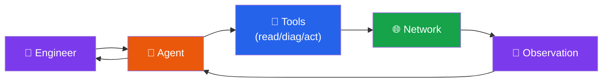

The agent **closes the loop** between intent and observation.

---

# LLM & Agent Fundamentals

### What an LLM really is

A **next-token predictor** trained on huge text corpora.

$$ P(t_{n+1} \mid t_1, \dots, t_n) $$

- Strong at **patterns** in text
- Weak at **exact math** and **fresh facts**
- Confident even when **wrong** (hallucination)

### Key parameters

| Param | Effect | NetOps |
|:--|:--|:--|
| `temperature` | Randomness | 0.1–0.3 |
| `max_tokens` | Output cap | 256–1024 |
| `seed` | Reproducible | Set for evals |

### From LLM → agent

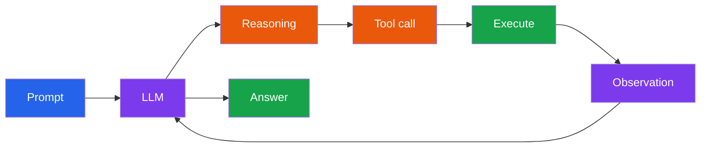

The loop is what turns words into **work**.

---

# Anatomy of an AI Agent

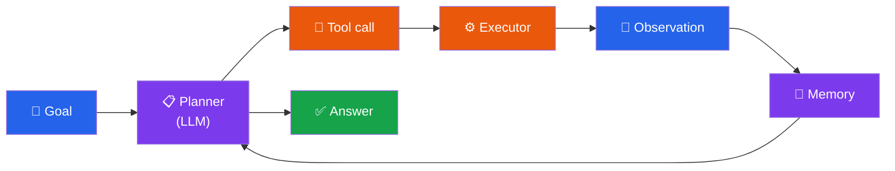

### Core patterns
- **ReAct** — Reason + Act loop
- **Plan-and-Execute** — plan first, then run
- **Reflection** — critique own output
- **Multi-agent** — specialists + supervisor

### State of an agent
- **Working memory** — current task
- **Long memory** — past episodes / RAG
- **Tools** — typed callables
- **Policy** — what is allowed

---
layout: section
---

# Part II
## Inputs & Tools

---

# Network Data Sources

### The data pyramid

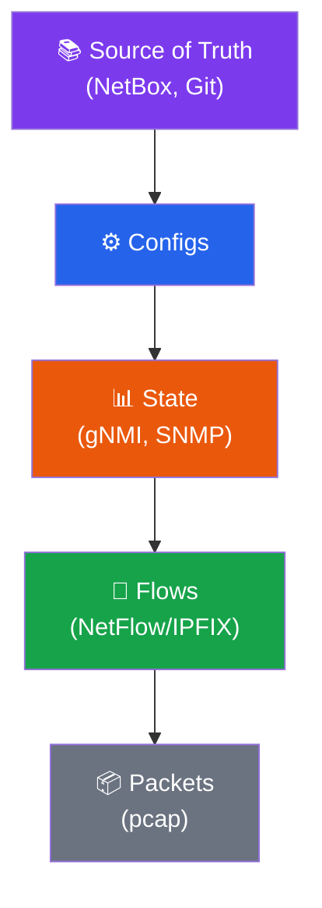

Up = **semantic richness** · Down = **raw volume**

### SNMP vs gNMI

| | SNMP | gNMI |
|:--|:--|:--|
| Model | UDP polling | gRPC streaming |
| Schema | MIBs (vendor) | YANG (OpenConfig) |
| Push | No | Yes |
| LLM-friendly | Hard | Easy (JSON) |

### Reference stack

NetBox · Prometheus · Loki · Tempo · OTel · Batfish (twin)

---

# Tools an Agent Needs

### Four tool families

| Family | Example | Risk |
|:--|:--|:--|
| **Read** | `get_bgp_neighbors` | Low |
| **Diagnostic** | `path_analysis`, `dry_run` | Low |
| **Action** | `push_config`, `clear_bgp` | High |
| **Knowledge** | `search_runbook` (RAG) | Low |

### Safe action design
- **Least privilege** scope
- **Idempotent** when possible
- **Dry-run** default
- **Approval** gate (HITL)
- **Auditable** + **reversible**

### MCP — Model Context Protocol

> Open standard exposing **tools / resources / prompts** to any LLM client.

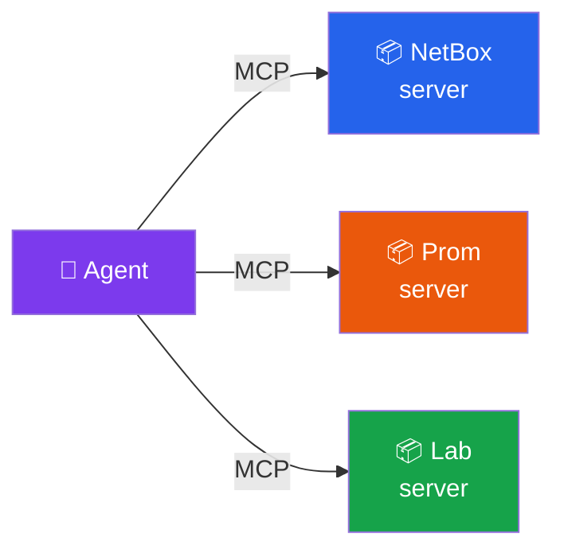

One protocol, many backends — vendor-neutral.

---

# RAG for NetOps

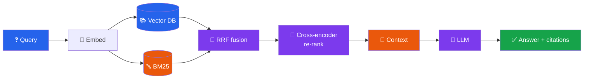

### Useful corpora
- Internal runbooks & post-mortems
- Vendor docs (Cisco/Juniper/Arista)
- RFCs · OpenConfig YANG · MIBs
- Design docs & topology drawings

### Eval metrics
- **Recall@k**, **MRR**, **nDCG** (retrieval)
- **Faithfulness** + **citation correctness** (answer)
- Always require **citations**

---

# RAG vs Fine-tune vs Tools

### RAG
**Inject knowledge**

Fresh docs, citable, cheap to update.

✅ Runbooks, RFCs
❌ Real-time state

### Fine-tune
**Shape behaviour**

Style, format, narrow tasks.

✅ Consistent output
❌ Expensive, stale

### Tools
**Read/act in real time**

APIs to the live network.

✅ Live state, actions
❌ Need safe design

In practice: combine all three — RAG for knowledge, tools for state/action, fine-tuning for style.

---
layout: section
---

# Part III
## Designing Agents

---

# Designing a Troubleshooting Agent

### The charter (1 page)
- **Goal** — *site A → site B unreachable*
- **Scope** — IP/OSPF/BGP only
- **Tools allowed** — read + diagnostic
- **Autonomy** — L1 (suggest, no write)
- **Budgets** — ≤ 8 tool calls, ≤ 30 s
- **Success** — RCA + recommended fix

### OSI-style decomposition

L1 link → L2 ARP/MAC → L3 routes → L4 reachability → app

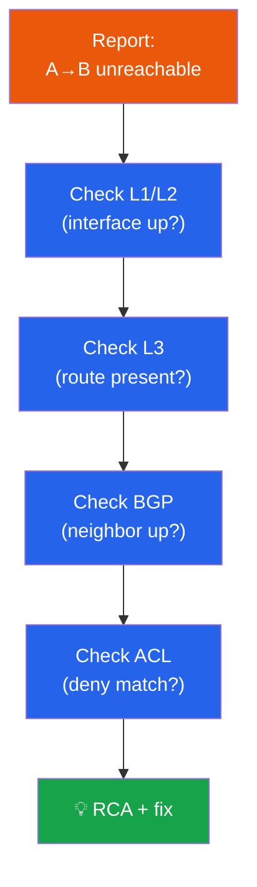

Each step is a **tool call** producing an observation.

---

# Multi-Agent Architectures

### Patterns

| Pattern | When |
|:--|:--|
| **Supervisor** | Dispatch to specialists |
| **Hierarchical** | Nested supervisors |
| **Pipeline** | Linear stages |
| **Swarm** | Peers + shared memory |
| **Debate** | Cross-check answers |

**MCP** = tools · **A2A** = agent-to-agent

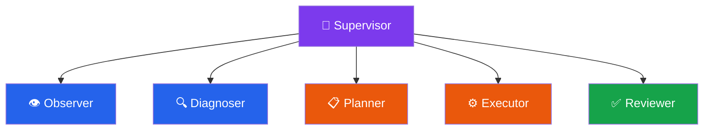

Specialised prompts + smaller context = better answers.

---

# Human-in-the-Loop

### Autonomy spectrum

| Level | Role |
|:--|:--|
| **L0** | Advisor (reads) |
| **L1** | Suggests, human acts |
| **L2** | Approve & run |
| **L3** | Acts in narrow scope |
| **L4** | Fully autonomous |

Promotion requires **evidence** (Ch 11).

### Approval gate (6 parts)
1. Change **summary** in plain English
2. **Diff** of proposed action
3. **Impact** estimate (devices, traffic)
4. **Rollback** plan
5. **TTL** (auto-cancel if no decision)
6. **Audit** record (who, when, why)

UI: Slack / ticket / web — choose the one operators already live in.

---

# Closed-Loop Automation

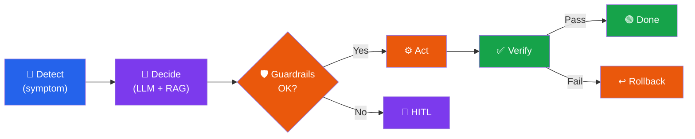

### Self-heal rubric
- Symptom is **observable**
- Cause is **bounded**
- Action is **scoped + reversible**
- Verification is **automatic**

### Kill switch
- One command stops all agents
- Documented · tested · drilled
- Logs preserved for post-mortem

---
layout: section
---

# Part IV
## Production

---

# Observability & Evaluation

### Trace tree

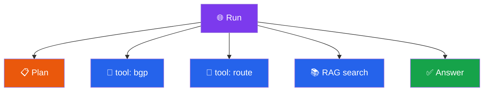

**Tools:** OpenTelemetry · Phoenix · LangSmith

### Four metric families
- **Quality** — accuracy, faithfulness
- **Efficiency** — latency, tool count
- **Cost** — $ / run
- **Reliability** — success rate

### Eval styles
- **Offline** — fixed dataset, LLM judge
- **Shadow** — run silently in prod
- **Canary** — 1% → 10% → 100%
- **A/B** — compare variants

---

# Safety, Security, Guardrails

### OWASP LLM Top 10 → NetOps

| Risk | NetOps example |
|:--|:--|
| Prompt injection | Malicious log line |
| Insecure output | Unchecked CLI string |
| Training data leak | Secrets in prompts |
| Model DoS | Tool-call loop |
| Supply chain | Rogue MCP server |
| Excessive agency | Wildcard ACL push |

### Layered defence

NeMo Guardrails · Llama Guard · Presidio · Lakera · Rebuff

---

# Cost, Performance, Model Selection

### Cost equation

$$ C = N_\text{runs} \cdot (T_\text{in} \cdot p_\text{in} + T_\text{out} \cdot p_\text{out}) $$

| Tier | Use case |
|:--|:--|
| **Small** (7–8B local) | Classify, extract |
| **Medium** (mini SaaS) | RCA, summarise |
| **Frontier** | Complex multi-step |

### Routing pattern

Small first → escalate only if **confidence low** or **task hard**.

### Quality vs cost

### Reduce cost
- Prompt **caching**
- **Quantised** local models (Ollama)
- **Memoise** tool results
- **Distil** repeating tasks

Local: Ollama · vLLM · TGI · NIM

---

# AgentOps Lifecycle

### Version everything
Prompts · tools · models · RAG index · graph · guardrails · eval set

### Improvement flywheel
Trace → curate failures → add to eval → fix → re-evaluate → promote autonomy

---

# Ethics, Limitations, Future

### Accountability
Humans + organisations remain responsible. The agent is **not** a defence.

### Today's limits
- Hallucination · bias · drift
- No true reasoning
- Persuasibility (prompt injection)
- Cost & latency tax

### Regulation (EU)
GDPR · **EU AI Act** (high-risk) · NIS2 · DORA

### Workforce shift

| Shrinks | Grows |
|:--|:--|
| Manual CLI | Designing safe automation |
| Tier-1 triage | Supervising agent fleets |
| Vendor memorisation | Reasoning + data + safety |

### Where it's heading
HITL agents → self-healing scoped loops → intent-driven networks → largely autonomous (with humans authoring policy)

---
layout: section
---

# Part V
## Capstone Projects

---

# Capstone Project Ideas

### Project menu
- **A** — BGP troubleshooter (MCP)
- **B** — NetFlow anomaly + RAG
- **C** — Multi-agent incident response
- **D** — Config drift + HITL
- **E** — Wi-Fi roaming RCA
- **F** — Compliance auditor
- **G** — Synthetic probe orchestrator
- **H** — NOC knowledge concierge

### Deliverables (all projects)
- 1-page **charter**
- Architecture **diagram**
- Reproducible **repo**
- **Toolset** spec
- **Eval set** ≥ 30 cases
- Eval **report** + safety review
- 5-min **demo** + post-mortem

### Grading weights
Correctness 25 · Safety 20 · Engineering 20 · Eval rigour 15 · Demo 10 · Originality 10

---

# Suggested 12-Week Timeline

```mermaid {scale: 0.55}
graph LR
    W1["W1<br/>Charter+lab"] --> W2["W2<br/>Tools+data"]
    W2 --> W3["W3<br/>First agent"]
    W3 --> W4["W4<br/>RAG/multi"]
    W4 --> W5["W5<br/>Guardrails"]
    W5 --> W6["W6<br/>Eval set"]
    W6 --> W7["W7<br/>Iterate"]
    W7 --> W8["W8<br/>HITL/loop"]
    W8 --> W9["W9<br/>Observ."]
    W9 --> W10["W10<br/>Shadow/canary"]
    W10 --> W11["W11<br/>Polish"]
    W11 --> W12["W12<br/>Defence"]
    style W1 fill:#2563eb,color:#fff
    style W6 fill:#ea580c,color:#fff
    style W10 fill:#ea580c,color:#fff
    style W12 fill:#16a34a,color:#fff
```

### Defence checklist
- Live end-to-end demo
- Every tool call appears in trace UI
- Name every metric on eval report
- One bug + post-mortem

### Show maturity
- One threat you defended against
- Justify your autonomy level
- Articulate **why** + **where** it fails

---

# Reference Lab Stack

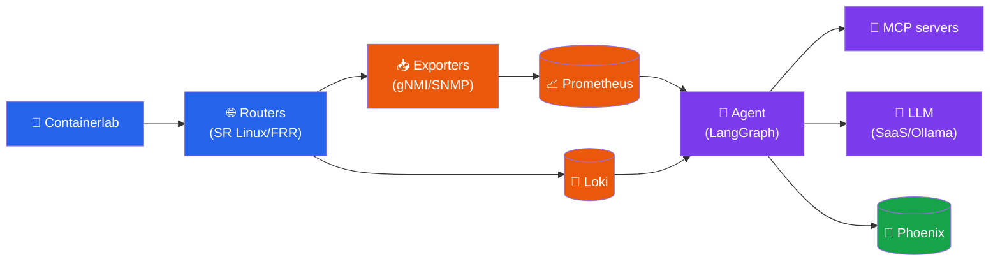

All open source · runs on a laptop · matches every capstone project

---

# Appendices

### A — Python & Async
asyncio · pydantic · tenacity · logging · pytest

### B — Lab Setup
Containerlab · NetBox · Prom/Loki · Phoenix · Ollama

### C — LLM APIs
OpenAI · Anthropic · Gemini · Ollama compat · tool calling · structured output

### D — Glossary
Every key term cross-referenced to chapters

### E — Further Reading
Foundational papers · safety · standards · books · blogs

### F — Sample Datasets
CAIDA · RIPE RIS · LogHub · Batfish examples · synthetic recipes

---
layout: center
class: text-center
---

# Summary

### What we covered

✅ From scripts to **agents**
✅ Tools, RAG, multi-agent
✅ HITL & closed loops
✅ Eval, safety, AgentOps
✅ Ethics + the road ahead

### Key takeaways

- Agents = **LLM + tools + loop**
- **Safety** beats cleverness
- **Evaluate** before you promote autonomy
- Humans stay **accountable**
- Network engineers run the **agents** of tomorrow

---
layout: center
class: text-center
---

# Thank you

  Agentic Ops for Network Engineers

Questions? · Full handout in <code>handout/</code>

